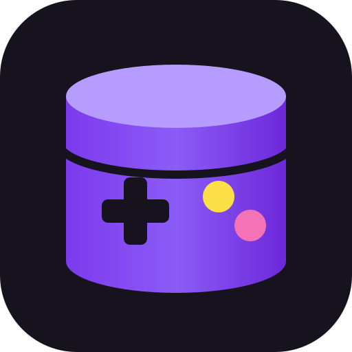

# 🎮 ZockDB

**Deine Spielesammlung an einem Platz – selbst gehostet, mobil, auf Deutsch.**

<p></p>

ZockDB (vormals „Videospielesammlung“) ist eine quelloffene Progressive Web App (PWA) zur Verwaltung von
**Spielen, Konsolen und Zubehör** – für dich allein oder zusammen mit Familie und Freunden
auf deinem eigenen Server. Sie ist für Sammler im deutschsprachigen
Raum gemacht: PAL-/USK-Regionen, CIB-Status, Sonderfarben, Editionen und Modellrevisionen
lassen sich sauber erfassen – per Titelsuche, **Barcode-Scan mit der Handykamera** oder als
eigener Eintrag für Raritäten, die in keiner Datenbank stehen.

> 🌐 **Kein eigener Server? Nutze die offizielle Seite [zockdb.de](https://zockdb.de)** – sofort startklar, mit Updates,
> Sicherungen und der gemeinsamen Tauschbörse aller Sammler. Wer dort mitmacht oder Zusatzleistungen (z. B. mehr
> Speicherplatz) bucht, **unterstützt die Weiterentwicklung von ZockDB** direkt. Danke! 💜

> 🇬🇧 An English version of this document is available in [README.en.md](README.en.md).

> 🔒 **Sicherheit hat höchste Priorität.** Du hast eine Sicherheitslücke gefunden? Ich freue mich über jeden Hinweis –
> bitte **vertraulich** über [GitHub Security Advisories](https://github.com/DrdotHouse2106/ZockDB/security/advisories/new)
> melden. Details in der [Sicherheitsrichtlinie (SECURITY.md)](SECURITY.md).

<p align="center">
  
  &nbsp;
  
  &nbsp;
  
  &nbsp;
  
</p>

<sub>Screenshots der echten App mit Beispieldaten (das Cover „Retro Racer“ ist ein selbst gestaltetes Beispielbild).</sub>

---

## Inhalt

- [Funktionen](#funktionen)
- [Schnellstart mit Docker](#schnellstart-mit-docker)
- [Konfiguration (.env)](#konfiguration-env)
- [Benutzerkonten & Zwei-Faktor-Anmeldung](#benutzerkonten--zwei-faktor-anmeldung)
- [Tauschbörse (Suche/Biete)](#tauschbörse-suchebiete)
- [Katalog, Moderation & Rollen](#katalog-moderation--rollen)
- [Plattformen, Varianten & Exemplare](#plattformen-varianten--exemplare)
- [Administration & Einstellungen](#administration--einstellungen)
- [Wert, Marktpreise & Preis-Historie](#wert-marktpreise--preis-historie)
- [Scans, Handbücher & Cover nachdrucken](#scans-handbücher--cover-nachdrucken)
- [Öffentliche Seiten](#öffentliche-seiten)
- [IGDB-Zugang einrichten](#igdb-zugang-einrichten)
- [Barcode-Scanner & HTTPS](#barcode-scanner--https)
- [Betrieb im Internet (Reverse-Proxy)](#betrieb-im-internet-reverse-proxy)
- [Installation ohne Docker](#installation-ohne-docker)
- [Datensicherung & Updates](#datensicherung--updates)
- [Datenfelder](#datenfelder)
- [Sicherheit](#sicherheit)
- [Mitwirken](#mitwirken)
- [Lizenz](#lizenz)

---

## Funktionen

- **Benutzerkonten** mit Registrierung, sicherer Passwortspeicherung (scrypt) und
  **Zwei-Faktor-Anmeldung** per Authenticator-App (TOTP) inkl. Wiederherstellungscodes
- **Wert der Sammlung:** Schätzwert je Artikel und gesamt, Gewinn/Verlust gegenüber dem Kaufpreis,
  Marktpreise (optional über PriceCharting) und anonyme Community-Werte („12 Sammler besitzen das“)
- **Öffentliche Sammlungen:** Wer möchte, macht seine Sammlung für alle angemeldeten Benutzer sichtbar –
  Preise, Seriennummern und Notizen bleiben immer privat
- **Scans & Dokumente je Spiel:** hochauflösende Cover-Scans (auch TIFF), Handbücher als PDF, Modul-Labels –
  privat oder mit anderen Benutzern geteilt
- **Cover nachdrucken:** Druckansicht in Originalgröße (anhand der Scan-Auflösung) oder in fester Größe
  (z. B. DVD-Einleger), mit Schnittmarken
- **Globaler Katalog mit Moderation:** Nur Admins/Moderatoren nehmen Einträge direkt auf; Nutzer reichen ein
  oder behalten ihre Einträge privat. Duplikate lassen sich zusammenführen
- **Plattformen als feste Kategorien** (PS5, Switch, N64 …) nach Hersteller gruppiert – mit Filter-Chips
- **Varianten & Exemplare:** bekannte Modellnummern/Revisionen je Gerät als Sammel-Checkliste,
  mehrere Exemplare pro Spiel/Konsole, gruppierte Ansicht
- **Private Kommentare** zu jedem Spiel/Gerät
- **Preis-Historie:** automatischer Marktpreis-Verlauf und gemeldete Angebote/Verkäufe (wo, wann, wie viel)
- **Drei Artikeltypen:** Spiele, Konsolen/Systeme und Zubehör (Controller, Kabel, Memory Cards …)
- **Varianten:** Farbe/Sonderfarbe (z. B. „Clear Red“, „Atomic Purple“), Edition (z. B. „Zelda 25th Anniversary“),
  Modellnummer/Revision (z. B. „SCPH-1002“, „OLED“) und Seriennummer
- **Barcode-Scanner im Browser** (EAN-13, EAN-8, UPC-A, UPC-E) über die Kamera – ganz ohne App-Store
- **Online-Suche über IGDB** (Twitch-API) für Spiele und Konsolen, inkl. Cover, Erscheinungsjahr und Publisher
- **Eigene Katalogeinträge** für Hardware, Zubehör und seltene deutsche Exoten
- **Lernender Barcode-Cache:** Einmal zugeordnete Barcodes werden beim nächsten Scan sofort erkannt
- **Lokaler Cache** in SQLite – wiederholte Suchen sind blitzschnell und schonen API-Limits
- **Eigene Fotos** pro Artikel (z. B. vom Modul oder der OVP)
- **Filter & Suche** nach Typ, Plattform, Region, Zustand und Vollständigkeit
- **Statistik:** Anzahl, Kaufwert, Verteilung nach Plattform, Region, Zustand
- **Export/Import:** JSON (vollständige Sicherung), CSV im deutschen Excel-Format und **Import aus CLZ Games/Excel**
- **Sammlung per Link teilen** – auch mit Menschen ohne Konto, Preise und Notizen bleiben privat
- **Erfolge & Sammlungsziele** je Plattform, **Benachrichtigungen** und E-Mail für „Passwort vergessen“
- **Automatische Datensicherung** (7 Tage täglich, 12 Monate monatlich)
- **Tauschbörse:** Spiele zum Verkauf oder Tausch anbieten, Wunschliste mit Treffer-Benachrichtigung, Tauschvorschläge,
  Nachrichten, Bewertungen – und für Händler ein CSV-Massen-Upload
- **PWA:** Installierbar auf Android, iOS und Desktop; zuletzt geladene Daten auch offline sichtbar
- **Hell & dunkel:** folgt automatisch dem Farbschema des Geräts
- **Administration:** Benutzer sperren, Rollen vergeben, 2FA zurücksetzen, Registrierung schließen
- **Komplett auf Deutsch** – Oberfläche, Formulare, Meldungen und Dokumentation

**Technik:** Node.js 22 · Express 5 · SQLite (better-sqlite3) · sharp · React 19 · Vite · Tailwind CSS 4 · html5-qrcode

---

## Schnellstart mit Docker

Voraussetzung: [Docker](https://docs.docker.com/get-docker/) mit Docker Compose – oder eine Oberfläche wie
Portainer, Dockge oder den Container Manager einer Synology/QNAP.

**Du brauchst nur die Datei [`docker-compose.yml`](docker-compose.yml)** – kein `git clone`, kein Bauen.
Das fertige Image wird automatisch von der GitHub Container Registry geladen
(`ghcr.io/drdothouse2106/zockdb`, für normale Server/PCs und ARM-Geräte wie Raspberry Pi).

1. Inhalt der [`docker-compose.yml`](docker-compose.yml) kopieren und als `docker-compose.yml` speichern
   bzw. in Portainer/Dockge als neuen **Stack** einfügen.
2. Die Einträge unter `environment:` anpassen (alle sind kommentiert; leere Werte `""` = Standard).
3. Starten:

```bash
docker compose up -d
```

Die App ist anschließend unter **<http://localhost:3000>** erreichbar. **Das erste Konto, das du
registrierst, wird Administrator.**

Nützliche Befehle:

```bash
docker compose logs -f                        # Protokoll ansehen
docker compose down                           # Anhalten (Daten bleiben erhalten)
docker compose pull && docker compose up -d   # Auf die neueste Version aktualisieren
```

In Portainer entspricht das Aktualisieren dem Knopf **„Update the stack“** mit aktivierter Option
**„Re-pull image“**.

Alle Daten (SQLite-Datenbank, Fotos, Scans und `geheimnis.key`) liegen im Docker-Volume
`sammlung-daten` und bleiben bei Updates und Neustarts erhalten.

### Nur die yml oder das Repository klonen?

Für den Betrieb ist **die yml mit Einträgen der bessere Weg**: Du lädst das geprüfte, fertige Image herunter
(die Tests laufen vorher automatisch auf GitHub), Updates sind ein einfaches `pull`, und alle Einstellungen stehen
übersichtlich an einer Stelle. Viele Werte lassen sich später zusätzlich in der App unter
*Administration → Einstellungen* ändern.

Klonen lohnt sich nur, wenn du **am Code etwas ändern** möchtest. Dann in der `docker-compose.yml` die Zeile
`image: …` durch `build: .` ersetzen und mit `docker compose up -d --build` starten.

Beide Wege lassen sich mischen: Statt der Einträge unter `environment:` kann auch eine `.env`-Datei neben der yml
liegen (`env_file: .env`). Für Portainer & Co. sind die Einträge in der yml aber am einfachsten.

### Die docker-compose.yml im Detail

| Eintrag | Bedeutung |
| --- | --- |
| `image` | Das fertige Image `ghcr.io/drdothouse2106/zockdb:latest`. Für eine feste Version z. B. `:1.2` statt `:latest` verwenden. |
| `container_name` | Name des Containers (`zockdb`), z. B. für `docker logs zockdb`. |
| `restart: unless-stopped` | Startet den Container nach einem Absturz oder Neustart des Servers automatisch wieder – außer du hast ihn bewusst angehalten. |
| `ports: "3000:3000"` | Host-Port links, Port im Container rechts (immer 3000). Für Port 8080: `"8080:3000"`. |
| `volumes: sammlung-daten:/app/data` | Speichert Datenbank, Fotos, Scans und `geheimnis.key` dauerhaft im Docker-Volume. |
| `environment` | **Alle Einstellungen** als Einträge – gruppiert nach Themen (Konten, E-Mail, Uploads, IGDB, Preise …). Die Bedeutung jedes Werts steht als Kommentar darüber und in der Tabelle unter [Konfiguration](#konfiguration-env). |

Datenbankpfad, Upload-Ordner und interner Port sind im Image fest eingestellt und müssen nicht angegeben werden.
Ein **Healthcheck** (`GET /api/health`) ist ebenfalls im Image hinterlegt – `docker compose ps` bzw. Portainer
zeigen `healthy`, sobald die App bereit ist.

**Häufige Anpassungen:**

- **Hinter einem Reverse-Proxy** (Caddy, nginx, Traefik, Nginx Proxy Manager) auf demselben Server: Port nur lokal
  freigeben, damit die App nicht ohne HTTPS von außen erreichbar ist, und `TRUST_PROXY: "1"` setzen:
  ```yaml
  ports:
    - "127.0.0.1:3000:3000"
  ```
- **Daten in einem Ordner statt im Volume:** `- ./data:/app/data` statt `- sammlung-daten:/app/data` und einmalig
  `mkdir -p data && sudo chown 1000:1000 data` ausführen (der Container läuft als Benutzer 1000).
- **Dollarzeichen in Werten** (z. B. in Schlüsseln) doppelt schreiben: `$$`. Compose würde `$` sonst als Variable deuten.

> **Wichtig:** Die yml enthält API-Schlüssel – teile sie nicht öffentlich. Setze `APP_SECRET` einmalig
> (`openssl rand -base64 32`) und ändere es danach **nie** wieder – oder sichere `geheimnis.key` aus dem Volume.
> Ohne den Schlüssel lassen sich 2FA-Geheimnisse und in der App gespeicherte API-Schlüssel nicht mehr entschlüsseln.
> `docker compose down -v` löscht das Volume samt **allen Daten**. Wie du es sicherst, steht unter
> [Datensicherung & Updates](#datensicherung--updates).

---

## Konfiguration (.env)

Die Grundkonfiguration erfolgt über Umgebungsvariablen – mit Docker als Einträge unter `environment:` in der
`docker-compose.yml`, ohne Docker in der Datei `.env`. Viele Werte können Administratoren zusätzlich unter
*Administration → Einstellungen* ändern (siehe [Administration & Einstellungen](#administration--einstellungen)). Vorlage ist die Datei
[`.env.example`](.env.example) – kopiere sie nach `.env`. **Die `.env`-Datei enthält
Geheimnisse und wird durch `.gitignore` nie ins Repository übernommen.**

> Wo in dieser Anleitung „in die `.env` eintragen“ steht, gilt mit Docker: als Eintrag unter `environment:` in der
> `docker-compose.yml` eintragen (z. B. `REQUIRE_2FA: "true"`) und den Container mit `docker compose up -d` neu starten.

| Variable               | Standard                  | Beschreibung |
| ---------------------- | ------------------------- | ------------ |
| `PORT`                 | `3000`                    | Port des Servers (bei Docker: Port auf dem Host) |
| `DATABASE_PATH`        | `data/sammlung.db`        | Pfad zur SQLite-Datenbank (bei Docker fest `/app/data/sammlung.db`) |
| `UPLOAD_DIR`           | `data/uploads`            | Ordner für hochgeladene Fotos (bei Docker fest `/app/data/uploads`) |
| `MAX_UPLOAD_MB`        | `8`                       | Maximale Dateigröße für Artikelfotos |
| `MEDIA_MAX_MB`         | `200`                     | Maximale Dateigröße für Scans und PDF-Handbücher |
| `MEDIA_SHARING`        | `true`                    | Dürfen Scans mit anderen Benutzern geteilt werden? |
| `STORAGE_QUOTA_MB`     | `1024`                    | Speicherplatz je Benutzer für eigene Fotos und Scans in MB (`0` = unbegrenzt) |
| `SMTP_HOST` / `SMTP_PORT` | – / `587`             | SMTP-Server für E-Mails (Passwort vergessen, Bestätigung, Benachrichtigungen) |
| `SMTP_SECURE`          | `auto`                    | `auto` (Port 465 = TLS, sonst STARTTLS), `true` oder `false` |
| `SMTP_USER` / `SMTP_PASSWORD` | –                  | Zugangsdaten des Postfachs |
| `SMTP_FROM`            | –                         | Absender, z. B. `ZockDB <noreply@example.de>` |
| `REQUIRE_EMAIL`        | `false`                   | E-Mail-Adresse bei der Registrierung verpflichtend |
| `CAPTCHA_PROVIDER`     | `altcha`                  | Spam-Schutz für Registrierung und „Passwort vergessen“: `altcha`, `recaptcha` oder `aus` |
| `RECAPTCHA_SITE_KEY` / `RECAPTCHA_SECRET` / `RECAPTCHA_MIN_SCORE` | – / – / `0.5` | Nur für Google reCAPTCHA v3 |
| `BACKUP_ENABLED`       | `true`                    | Automatische Datenbank-Sicherung im Datenordner (`sicherungen/`) |
| `BACKUP_DAYS` / `BACKUP_MONTHS` | `7` / `12`       | Aufbewahrung der täglichen bzw. monatlichen Sicherungen |
| `BACKUP_REMOTE`        | `aus`                     | Externe, verschlüsselte Sicherung: `s3`, `webdav` oder `sftp` (Details unter [Datensicherung](#datensicherung--updates); weitere `BACKUP_REMOTE_*`-Werte am einfachsten in der Oberfläche) |
| `TWITCH_CLIENT_ID` / `TWITCH_CLIENT_SECRET` | –    | Zugang für die Online-Suche über IGDB (siehe unten) |
| `BARCODE_PROVIDERS`    | `opengtindb,upcitemdb`    | Reihenfolge der Barcode-Datenbanken; leer = nur lokal gelernte Barcodes |
| `OPENGTINDB_QUERYID`   | –                         | Zugangsnummer für [opengtindb.org](https://opengtindb.org) (deutsche EAN-Datenbank) |
| `REGISTRATION_OPEN`    | `true`                    | Dürfen sich neue Benutzer selbst registrieren? |
| `REGISTRATIONS_PER_HOUR` | `5`                     | Max. Registrierungen pro IP-Adresse und Stunde |
| `REQUIRE_2FA`          | `false`                   | Zwei-Faktor-Anmeldung für alle Benutzer verpflichtend |
| `SESSION_DAYS`         | `30`                      | Gültigkeit einer Anmeldung in Tagen (verlängert sich bei Nutzung) |
| `COOKIE_SECURE`        | `auto`                    | Sitzungs-Cookie nur über HTTPS (`auto`, `true`, `false`) |
| `APP_SECRET`           | automatisch               | Schlüssel zum Verschlüsseln von 2FA-Geheimnissen und API-Schlüsseln; leer = wird erzeugt und in `data/geheimnis.key` gespeichert |
| `TRUST_PROXY`          | –                         | Hinter einem Reverse-Proxy `1` setzen (für HTTPS-Cookies und IP-basierte Sperren) |
| `PUBLIC_URL`           | –                         | Öffentliche Adresse, z. B. `https://sammlung.example.de` – nötig für Links in E-Mails |
| `PUBLIC_CATALOG`       | `true`                    | Katalogseiten und Suche ohne Anmeldung zeigen (Sammlungen bleiben privat); `false` = alles nur nach Anmeldung |
| `LINK_DOMAINS`         | –                         | Links zu Cover-/Handbuch-Seiten nur zu diesen Domains erlauben (kommagetrennt) |
| `PRICECHARTING_TOKEN`  | –                         | API-Token für Marktpreise von [PriceCharting](https://www.pricecharting.com) |
| `EBAY_CLIENT_ID` / `EBAY_CLIENT_SECRET` | –        | Zugang zur offiziellen eBay-API für den automatischen Preisimport |
| `PRICE_IMPORT_HOURS`   | `24`                      | Automatischer Preisimport alle X Stunden (`0` = aus) |
| `AFFILIATE_LINKS`      | `true`                    | „Hier kaufen“-Links anzeigen (`false` = ausblenden) |
| `MARKET_ENABLED`       | `true`                    | Tauschbörse (Suche/Biete) ein- oder ausschalten |
| `MARKET_OFFER_DAYS`    | `90`                      | Laufzeit eines Angebots in Tagen |
| `MARKET_MAX_OFFERS`    | `50`                      | Kostenlose aktive Angebote je Benutzer (auch per CSV-Upload) |
| `MARKET_PACKAGES`      | `500=9,90;1000=14,90;5000=29,90` | Händler-Pakete: Anzahl aktiver Angebote = Monatspreis in € |
| `MARKET_API_PRICE`     | `19,90`                   | Monatspreis des Zusatzpakets API-Anbindung (Shop/ERP) |
| `PAYMENT_*`            | –                         | Zahlungen: `PAYMENT_STRIPE_SECRET_KEY`, `PAYMENT_STRIPE_WEBHOOK_SECRET`, `PAYMENT_PAYPAL_CLIENT_ID`, `PAYMENT_PAYPAL_SECRET`, `PAYMENT_PAYPAL_WEBHOOK_ID`, `PAYMENT_PAYPAL_MODE` (`live`/`sandbox`), `PAYMENT_PAYPAL_FEE` (`1,00`), `PAYMENT_VAT_RATE` (`19`), `PAYMENT_INVOICE_ENABLED` (`true`), `PAYMENT_INVOICE_DAYS` (`7`) |
| `ERPNEXT_*`            | –                         | Rechnungen: `ERPNEXT_URL`, `ERPNEXT_API_KEY`, `ERPNEXT_API_SECRET`, `ERPNEXT_COMPANY`, `ERPNEXT_ITEM_CODE` (`ZOCKDB-ABO`), `ERPNEXT_TAX_TEMPLATE`, `ERPNEXT_ACCOUNT_STRIPE`, `ERPNEXT_ACCOUNT_PAYPAL`, `ERPNEXT_PRINT_FORMAT` (`Standard`) |
| `MARKET_TRIAL_DAYS`    | `0`                       | Testzugang, den verifizierte Händler einmalig selbst starten können (Tage, `0` = nur durch Administratoren) |
| `MARKET_MIN_ACCOUNT_DAYS` | `3`                    | Neue Konten ohne bestätigte E-Mail dürfen erst nach X Tagen Nachrichten schreiben |
| `MARKET_PRO_CONTACT` / `MARKET_PRO_INFO` | –   | Kontakt (E-Mail oder https-Adresse) für Buchungen und individuelle Anbindungen, Zusatzhinweis zu den Preisen (z. B. „zzgl. MwSt.“) |

Ohne IGDB-Zugangsdaten funktioniert die App vollständig – die Online-Suche entfällt dann,
und du legst Artikel als eigene Einträge an. Alle weiteren Einträge sind in der
[`docker-compose.yml`](docker-compose.yml) bzw. [`.env.example`](.env.example) kommentiert.

---

## Benutzerkonten & Zwei-Faktor-Anmeldung

- **Registrierung:** Jeder kann sich selbst ein Konto anlegen (abschaltbar mit `REGISTRATION_OPEN=false`).
  Das **erste** Konto wird Administrator – auch bei geschlossener Registrierung.
- **Passwörter** werden mit scrypt gehasht gespeichert (mindestens 10 Zeichen).
- **Zwei-Faktor-Anmeldung (2FA):** Unter *Mehr → Konto & Sicherheit → 2FA einrichten* den QR-Code mit
  einer Authenticator-App scannen (z. B. Aegis, 2FAS, Google/Microsoft Authenticator, Bitwarden, 1Password).
  Danach werden **10 Wiederherstellungscodes** angezeigt – sicher aufbewahren! Jeder Code funktioniert einmal,
  falls das Handy verloren geht.
- **2FA-Pflicht:** Mit `REQUIRE_2FA=true` müssen alle Benutzer die 2FA einrichten, bevor sie die App nutzen können.
- **Schutzmaßnahmen:** Begrenzung von Fehlversuchen (Anmeldung, 2FA-Codes, Registrierung), HttpOnly-/SameSite-Cookies,
  Prüfung der Herkunft bei ändernden Anfragen (CSRF-Schutz), Content-Security-Policy, verschlüsselt gespeicherte 2FA-Geheimnisse.
- **Administration** (*Mehr → Benutzerverwaltung*): Konten sperren, Admin-Rechte vergeben, Passwort neu setzen,
  2FA zurücksetzen (z. B. wenn jemand Handy und Wiederherstellungscodes verloren hat) und Konten löschen.
- **Passwort vergessen?** Mit eingerichtetem E-Mail-Versand per Link (siehe unten), sonst setzt ein Administrator ein neues Passwort.

> **Upgrade von Version 1:** Bestehende Artikel werden beim ersten Registrieren automatisch dem ersten
> (Administrator-)Konto zugeordnet. Die alten Variablen `AUTH_USER`/`AUTH_PASSWORD` entfallen.

---

### E-Mail & „Passwort vergessen“

Mit einem SMTP-Postfach (`SMTP_*` – auch unter *Administration → Einstellungen → E-Mail*, dort gibt es eine
**Test-E-Mail**) und gesetzter `PUBLIC_URL` schaltet ZockDB E-Mail-Funktionen frei:

- **E-Mail-Adresse im Konto** (freiwillig, mit `REQUIRE_EMAIL=true` Pflicht bei der Registrierung) – gilt erst nach Bestätigung.
- **Passwort vergessen** auf der Anmeldeseite: Link per E-Mail, 60 Minuten gültig, nur einmal verwendbar. Eine aktive
  Zwei-Faktor-Anmeldung bleibt bestehen.
- **Sicherheitshinweise** bei Passwortänderung, Passwort-Reset und abgeschalteter 2FA.

E-Mail-Adressen sind für andere Benutzer nie sichtbar.

### Spam-Schutz bei der Registrierung

Registrierung und „Passwort vergessen“ sind zusätzlich geschützt (`CAPTCHA_PROVIDER`):

- **ALTCHA** (Standard): unsichtbare Rechenaufgabe im Browser, selbst gehostet, ohne Cookies und ohne Daten an Dritte.
- **Google reCAPTCHA v3**: überträgt Daten an Google und wird deshalb erst nach Einwilligung geladen.
- **aus**: z. B. wenn die Registrierung ohnehin geschlossen ist.

### Sammlung per Link teilen

Unter *Konto → Sammlung teilen → Per Link teilen* erzeugt jeder Benutzer einen **geheimen Link** (`/sammlung/…`), über den
auch Menschen **ohne Konto** die Sammlung ansehen können – gruppiert nach Plattform, mit Cover, Zustand und Vollständigkeit,
optional mit geschätztem Gesamtwert. Kaufpreise, Seriennummern, Notizen, Barcodes und eigene Fotos bleiben privat.
Der Link ist nicht erratbar, wird nicht von Suchmaschinen erfasst (`noindex`) und nicht zwischengespeichert. Mit
„Neuen Link erstellen“ oder „Teilen beenden“ wird der bisherige Link sofort ungültig. Einträge aus dem öffentlichen
Katalog verlinken auf ihre Spieleseite.

### Erfolge & Sammlungsziele

Unter *Mehr → Erfolge & Sammlungsziele* schalten Sammler **Abzeichen** frei – z. B. „Erste Schritte“, „Leidenschaftlicher
Sammler“ (100 Exemplare), „Komplettist“ (25 CIB-Spiele), „Zeitreisender“ (Spiel vor 1990), „Regionen-Jäger“, „Scanner-Profi“,
„Helfer“/„Kurator“ für freigegebene Beiträge oder „Sicher ist sicher“ für aktivierte 2FA. Beim Freischalten gibt es eine
Benachrichtigung. Offene Erfolge zeigen ihren Fortschritt. Dazu kommen **Sammlungsziele je Plattform**: eigene Spiele im
Vergleich zu allen in der Datenbank bekannten Spielen der Plattform.

### Import aus CLZ Games, Excel & Co.

Unter *Mehr → Datensicherung → CSV importieren* lassen sich Sammlungen aus **CLZ Games** (Export als CSV), aus Tabellen
(Excel/LibreOffice → „Speichern unter → CSV“) oder aus dem eigenen CSV-Export übernehmen:

1. Datei wählen – Trennzeichen (`;`, `,`, Tab) und Zeichensatz (UTF-8 oder Windows-1252) werden erkannt.
2. Spalten werden anhand der Überschriften automatisch zugeordnet (deutsch, englisch, CLZ) und lassen sich anpassen; eine
   Vorschau zeigt die ersten Zeilen.
3. Werte werden übersetzt: Regionen (Germany → PAL-DE, USA → NTSC-U, Japan → NTSC-J …), Vollständigkeit (Complete → CIB,
   Loose → lose …), Zustand (Very Good → sehr gut, Sealed → Neu/OVP …), Beträge und Datumsangaben in deutscher und englischer Schreibweise.
4. Optional werden Artikel mit dem öffentlichen Katalog verknüpft, wenn Titel und Plattform eindeutig passen.

Bis zu 5.000 Zeilen pro Datei; fehlerhafte Zeilen werden mit Zeilennummer und Grund aufgelistet und übersprungen.

### Benachrichtigungen

Die **Glocke** oben in der App zeigt neue Benachrichtigungen, z. B. wenn eine Einreichung (Katalogeintrag, Variante, Scan,
Link) freigegeben oder abgelehnt wurde, wenn eine Meldung oder ein Vorschlag
bearbeitet wurde oder sich die eigene Rolle geändert hat. Wer eine bestätigte E-Mail-Adresse hat, kann unter *Konto*
zusätzlich **E-Mail-Benachrichtigungen** einschalten (standardmäßig aus). Je Benutzer werden die letzten 200 gespeichert.

---

## Tauschbörse (Suche/Biete)

Unter *Mehr → Tauschbörse* finden Sammler Käufer und Tauschpartner. ZockDB wickelt **keine Zahlungen** ab – Kauf,
Bezahlung und Versand vereinbaren die Beteiligten direkt miteinander.

- **Anbieten:** Auf der Seite eines Spiels oder bei einem Exemplar deiner Sammlung auf „Anbieten“ tippen – zum Verkauf,
  zum Tausch oder beides, mit Preisvorstellung, Zustand, Versand/Abholung. Von der Postleitzahl werden nur die ersten
  zwei Ziffern gespeichert. Angebote laufen nach `MARKET_OFFER_DAYS` Tagen ab und lassen sich mit einem Klick verlängern.
- **Fotos:** bis zu sechs Fotos je Angebot, direkt mit der Handykamera. Sie werden verkleinert, Standort- und andere
  Metadaten werden entfernt; beim Anbieten aus der Sammlung wird das Foto des Exemplars übernommen. Fotos zählen zum
  Speicherkontingent und sind nur angemeldet und nur für aktive Angebote sichtbar.
- **Wunschliste:** „Auf die Wunschliste“ – optional mit Plattform, Region, Mindestzustand, nur CIB und Höchstpreis.
  Wird ein passendes Angebot eingestellt, gibt es eine Benachrichtigung. Die Spieleseiten zeigen, wie viele Sammler
  ein Spiel anbieten oder suchen.
- **Anonymes Marktarchiv:** Jede Anzeige wird ohne Bezug zum Anbieter archiviert (Spiel, Plattform, Zustand, Region, Preise
  von Start bis Ende, Laufzeit, Ergebnis wie „verkauft“, Aufrufe/Anfragen), dazu täglich die Nachfrage je Spiel (Suchende,
  Preisvorstellung, Angebote, Preise). Datenbank-Trigger erfassen dabei jeden Weg – auch CSV-Import, Ablauf und Konto-Löschung.
  Administratoren sehen unter *Administration → Marktdaten* eine Übersicht und laden die Daten als CSV herunter
  (Grundlage für Preisentwicklungen und Marktberichte). Rechtstexte weisen auf die Nutzung hin.
- **Preisindex** (öffentlich, für Suchmaschinen): `/preisindex` und `/preisindex/<plattform>` zeigen meistverkaufte Spiele mit
  Median-Verkaufspreis, Preisaufsteiger (6 Monate gegenüber den 6 davor), meistgesuchte Titel und die Verkäufe je Monat –
  nur aus echten, gemeldeten bzw. bestätigten Verkäufen und erst ab drei Verkäufen je Titel. Die Spieleseiten zeigen den
  Median ebenfalls („Tatsächlich verkauft“).
- **Öffentliche Händlerseiten** (`/haendler`, `/haendler/<id>-<name>`): Jeder verifizierte Händler bekommt eine Seite mit
  Angeboten, Versandinfos, Bewertungen und Anbieterkennzeichnung (schema.org `Store`). Bei Suchmaschinen gelistet (Sitemap,
  `index`) und mit echtem Shop-Link (ohne `nofollow`) nur mit aktivem Händler-Paket – ein weiterer Vorteil der Pakete.
- **Tauschvorschläge:** Die App findet Sammler, die haben, was du suchst, und gleichzeitig suchen, was du tauschen möchtest.
- **Nachrichten** zu Angeboten innerhalb der App (E-Mail-Adressen bleiben verborgen), danach gegenseitige **Bewertungen**.
- **Verkaufsbestätigung:** Beim Markieren als verkauft fragt die App nach dem tatsächlichen Preis und dem Käufer (einer der
  Interessenten, „außerhalb von ZockDB“ oder keine Angabe; später nachtragbar). Der Käufer bestätigt mit einem Klick, korrigiert
  den Preis oder bestreitet den Kauf. Im Marktarchiv gibt es damit drei Stufen – *bestätigt*, *gemeldet* und *nur Angebotspreis* –,
  bestrittene Verkäufe zählen nicht. Preisentwicklungen nutzen nur echte Verkaufspreise.
- **Statistik** (*Meine Börse → Statistik*, Teil der Händler-Pakete): Aufrufe, Anfragen und Wunschlisten-Treffer je
  Angebot und Tag, Anfragequote, Vergleich zum Zeitraum davor und die meistgesuchten eigenen Titel. Ohne Paket gibt es nur
  die Gesamtzahlen der letzten 30 Tage; gezählt wird aber immer, sodass nach dem Buchen der Verlauf sofort da ist. Gespeichert werden nur Tageszähler – keine Namen,
  IP-Adressen oder Cookies; eigene Aufrufe und Bots zählen nicht, die Werte bleiben für Langzeitvergleiche (Zeitraum „Gesamt“ mit Monatswerten) erhalten.
- **Schutz:** Angebote lassen sich melden, Benutzer blockieren; neue Konten ohne bestätigte E-Mail-Adresse dürfen erst
  nach einer Wartezeit schreiben, Nachrichten sind mengenmäßig begrenzt. Angebote gibt es nur für freigegebene Katalogeinträge.
- **Händler:** Unter *Meine Börse → Händler & Massen-Upload* hinterlegen gewerbliche Anbieter ihre Anbieterkennzeichnung
  und laden Angebote per **CSV** hoch (z. B. aus dem Export eines Onlineshops). Zuordnung über ZockDB-ID, EAN oder
  Titel + Plattform; mit Artikelnummer werden Angebote bei jedem Upload aktualisiert, Bestand 0 beendet sie. Nach Prüfung
  durch einen Administrator (*Benutzerverwaltung → Anbieterkennzeichnung prüfen*) gilt der Händler als verifiziert.
- **Kostenlos und Pakete:** Ohne Bezahlung sind `MARKET_MAX_OFFERS` (Standard 50) aktive Angebote möglich – auch per CSV.
  Verifizierte Händler können **Pakete** mit mehr Angeboten buchen (Standard 500, 1.000 oder 5.000; Preise über
  `MARKET_PACKAGES`; darüber individuell nach Absprache), inklusive vollständiger Nachfrage-Auswertung und Statistik. Läuft ein Paket aus, werden Angebote über dem
  kostenlosen Limit beendet (die zuletzt bearbeiteten bleiben aktiv).
- **Zusatzpaket API-Anbindung** (`MARKET_API_PRICE`, Standard 19,90 € im Monat): automatischer Bestandsabgleich mit
  **Shopware 6** (Admin-API) oder einem **CSV-Feed** per https. Zugangsdaten der Händler werden verschlüsselt gespeichert;
  Abrufe gehen nur an öffentliche https-Adressen. Für andere Systeme (ERP, Shopsoftware) weist der Händlerbereich auf
  individuelle Anbindungen hin.
- **Testzugang:** Administratoren richten Händlern einen kostenlosen Test für beliebig viele Tage ein (größtes Paket +
  API-Anbindung). Mit `MARKET_TRIAL_DAYS` können verifizierte Händler zusätzlich einmalig selbst einen Test starten.
  Drei Tage vor Ende gibt es eine Erinnerung, danach endet der Test automatisch.
- Pakete und API-Anbindung schaltet ein Administrator mit Ablaufdatum frei (*Benutzerverwaltung → Anbieterkennzeichnung
  prüfen*) – oder der Händler bucht selbst (siehe unten).

### Automatische Zahlungen und Rechnungen (optional)

Mit Zugangsdaten für **Stripe** (Karte, SEPA-Lastschrift) und/oder **PayPal** buchen verifizierte Händler Pakete und die
API-Anbindung selbst als monatliches Abo. PayPal kostet eine Zahlungsgebühr zusätzlich (`PAYMENT_PAYPAL_FEE`, Standard 1 €
netto). Alle Preise sind Nettopreise, berechnet wird mit `PAYMENT_VAT_RATE` (Standard 19 %).

1. Händler wählt ein Paket → Bezahlseite von Stripe bzw. PayPal (Karten- und Kontodaten landen nie auf dem Server).
2. Der Zahlungsanbieter meldet die Zahlung per Webhook (Signatur wird geprüft) → das Paket wird bis zum Ende des bezahlten
   Monats plus drei Tage Puffer freigeschaltet. Verlängerungen laufen automatisch; nach Kündigung oder fehlgeschlagener
   Zahlung läuft das Paket aus. Ein neues Paket ersetzt das bisherige Abo. Während eines Testzugangs beginnt die
   Abrechnung bei Stripe erst mit dessen Ende.
3. **Auf Rechnung kaufen** ist die Standard-Zahlungsart (`PAYMENT_INVOICE_ENABLED`, Standard an, braucht ERPNext): ERPNext legt die Rechnung mit Zahlungsziel
   (`PAYMENT_INVOICE_DAYS`, Standard 7 Tage) an und verschickt sie per E-Mail mit PDF (`ERPNEXT_PRINT_FORMAT`, am besten
   mit Bankverbindung). Die Leistung beginnt sofort; den Zahlungseingang buchst du in ERPNext, ZockDB erkennt ihn alle
   15 Minuten. Ist eine Rechnung drei Tage nach Fälligkeit offen, wird der Zugang pausiert und nach Zahlung automatisch
   wieder freigeschaltet. Folgerechnungen werden sieben Tage vor Ende des Zeitraums gestellt.
4. Für jede Zahlung legt ZockDB in **ERPNext** automatisch eine gebuchte Ausgangsrechnung mit **Leistungszeitraum**
   (Felder „Von/Bis“ und Positionstext) an (Kunde wird aus der
   Anbieterkennzeichnung angelegt, Umsatzsteuer aus der eingestellten Vorlage) und verbucht die Zahlung auf dem Konto des
   Zahlungsanbieters. Ist ERPNext nicht erreichbar, wird es alle 15 Minuten erneut versucht. Händler laden ihre Rechnungen
   als PDF im Händlerbereich herunter; Administratoren sehen alle Zahlungen unter *Administration → Zahlungen*.

Einrichtung unter *Administration → Einstellungen → Zahlungen* bzw. *Rechnungen (ERPNext)*; `PUBLIC_URL` muss gesetzt sein.
Webhook-Adressen: `PUBLIC_URL/api/zahlung/stripe/webhook` und `PUBLIC_URL/api/zahlung/paypal/webhook` (die nötigen
Ereignisse stehen bei den Einstellungen). Zum Ausprobieren eignen sich die Testschlüssel von Stripe und die PayPal-Sandbox.

**Erstattungen und Gutschriften:** Unter *Administration → Zahlungen* erstattest du eine Zahlung ganz oder teilweise
(Stripe und PayPal zahlen automatisch zurück, bei Rechnung überweist du selbst), optional mit sofortigem Ende des Abos.
Erstattungen direkt im Stripe- oder PayPal-Dashboard kommen per Webhook an. In beiden Fällen legt ZockDB in ERPNext eine
Gutschrift (Rückbuchung gegen die ursprüngliche Rechnung, gleiche Steuer) an. Guthaben aus Abowechseln kannst du in der
Benutzerverwaltung auszahlen – ebenfalls mit Gutschrift. Händler laden Gutschriften als PDF im Händlerbereich herunter.

**Wechsel mit Verrechnung:** Bucht ein Händler ein anderes Paket (größer oder kleiner) oder wechselt die Zahlungsart, wird
das bisherige Abo beendet und der nicht genutzte Rest tagesgenau gutgeschrieben. Die Gutschrift wird mit der neuen Zahlung
verrechnet – auf der ERPNext-Rechnung als ausgewiesener Abzug vom Nettobetrag, bei Stripe als einmaliger Rabatt, bei PayPal
als günstigerer erster Monat. Ein Überschuss (z. B. beim Wechsel auf ein kleineres Paket) bleibt als Guthaben stehen und
wird mit den nächsten Rechnungen verrechnet (bei Stripe automatisch als Kundenguthaben).

Wer die Börse nicht braucht, schaltet sie mit `MARKET_ENABLED=false` oder unter *Administration → Einstellungen* ab.

---

## Katalog, Moderation & Rollen

Jeder Artikel in einer Sammlung gehört zu einem **Katalogeintrag** (das „Spiel“ bzw. „Gerät“ an sich).
Eigene Einträge sind zunächst **privat**. Wer möchte, **reicht sie ein**; nach Freigabe durch einen Moderator oder
Administrator stehen sie allen Benutzern des Servers zur Verfügung. IGDB-Treffer sind automatisch freigegeben.

- **Rollen:** *Nutzer*, *Moderator*, *Administrator* (vergibt der Admin unter *Mehr → Benutzerverwaltung*).
- **Moderation** (*Mehr → Moderation*): Einreichungen freigeben oder mit Begründung ablehnen, Duplikate zusammenführen,
  gemeldete Inhalte bearbeiten.
- **Barcodes** werden je Benutzer gelernt – ein Barcode verrät nie einen privaten Eintrag eines anderen.

---

## Plattformen, Varianten & Exemplare

- **Plattformen** sind feste Kategorien mit Kürzel und Hersteller (z. B. *PS5 – PlayStation 5 – Sony*). Rund 40 Systeme
  sind vorinstalliert; Moderatoren ergänzen weitere unter *Moderation → Plattformen* (inkl. alternativer Namen, damit
  z. B. „Genesis“ automatisch dem Mega Drive zugeordnet wird). In der Sammlung filterst du per Plattform-Chip,
  der **Katalog** ist nach Hersteller und Plattform gegliedert.
- **Varianten/Revisionen:** Zu jedem Katalogeintrag gibt es eine Liste bekannter Varianten (Modellnummer, Farbe, Edition,
  Region, Jahr) – z. B. *SCPH-1002, SCPH-5552, SCPH-9002, PSone*. Die Liste dient als **Sammel-Checkliste**: Du siehst,
  welche Revisionen dir noch fehlen. Nutzer schlagen Varianten vor, Moderatoren geben sie frei.
- **Mehrere Exemplare:** Über *Weiteres Exemplar / Variante* legst du ein zweites Exemplar mit übernommenen Grunddaten an
  und wählst nur noch die Variante. In der Sammlung werden Exemplare desselben Eintrags zu einer Karte gruppiert
  (abschaltbar im Filter).

---

## Administration & Einstellungen

Administratoren finden unter **Mehr → Administration** eine Übersicht, die Benutzerverwaltung, die Sicherungen und:

- **Rechtliches:** Impressum, Datenschutzerklärung, Nutzungsbedingungen und Sicherheit direkt in der App bearbeiten
  (einfaches Markdown mit Vorschau). Vorlagen sind enthalten – alle Angaben in [eckigen Klammern] ersetzen
  (die Vorlagen sind keine Rechtsberatung). Nur nötig, wenn dein Server öffentlich erreichbar ist.
- **Einstellungen:** Viele Werte der `.env` (Registrierung, 2FA-Pflicht, Speicher, E-Mail, Spam-Schutz, Sicherungen,
  IGDB-, eBay- und PriceCharting-Zugang …) lassen sich hier **ohne Neustart** ändern. Sie haben Vorrang vor der `.env`;
  „Auf .env-Wert zurücksetzen“ entfernt sie wieder. API-Schlüssel werden verschlüsselt gespeichert und nie wieder im
  Klartext angezeigt. Sicherheitsrelevante Änderungen erfordern dein Passwort (und ggf. einen 2FA-Code).
- **Nur über die `.env`** änderbar bleiben `APP_SECRET`, Pfade, Port, `TRUST_PROXY`, `COOKIE_SECURE`, `SESSION_DAYS`
  und `REGISTRATIONS_PER_HOUR` – eine Fehleinstellung dort könnte dich aussperren.

> **Hinweis:** Wird `APP_SECRET` geändert (oder `data/geheimnis.key` gelöscht), können in der Oberfläche gespeicherte
> Schlüssel nicht mehr entschlüsselt werden und müssen neu eingegeben werden.

---

## Wert, Marktpreise & Preis-Historie

Die Seite **Wert** zeigt den geschätzten Wert deiner Sammlung, die Summe der Kaufpreise und die
Wertentwicklung. Jeder Artikel bekommt seinen Schätzwert aus der ersten verfügbaren Quelle:

1. **Eigene Schätzung** – Feld „Marktwert“ am Artikel (hat immer Vorrang).
2. **PriceCharting** (optional, `PRICECHARTING_TOKEN`) – Marktpreise passend zu Region (PAL/NTSC/JP) und
   Vollständigkeit (lose, CIB, neu, nur OVP). Die Preise kommen in US-Dollar und werden mit dem Tageskurs
   der Europäischen Zentralbank in Euro umgerechnet. PriceCharting erfordert ein kostenpflichtiges Abo mit API-Zugang.
3. **Community** – Median der Schätzwerte aller Sammler auf deinem Server.

Auf der Detailseite jedes Spiels siehst du außerdem, **wie viele Sammler es besitzen**, wie viele Exemplare es
insgesamt gibt und – ab drei Angaben, damit niemand einzeln zurückverfolgt werden kann – den Median von Kauf- und
Schätzpreisen.

> Hinweis: Es gibt keine kostenlose, offizielle Preisdatenbank für den deutschen Markt. Alle Werte sind Schätzungen
> ohne Gewähr.

**Preis-Historie:** Die Katalogseite jedes Spiels zeigt einen Preisverlauf aus gespeicherten Marktpreisen,
automatisch importierten eBay-Angeboten und von Benutzern gemeldeten Angeboten/Verkäufen (wo, wann, wie viel – für andere anonym).

**Automatischer Preisimport (optional):** Mit einem kostenlosen Zugang unter <https://developer.ebay.com>
(*Application Keys* → Keyset für **Production**) `EBAY_CLIENT_ID` (App ID) und `EBAY_CLIENT_SECRET` (Cert ID) eintragen.
Die App holt dann regelmäßig (`PRICE_IMPORT_HOURS`) aktuelle Angebote für die gesammelten Spiele.

**„Hier kaufen“-Links:** Katalogseiten zeigen – als **Anzeige** gekennzeichnet – Suchlinks zu Shops.
Mit `AFFILIATE_LINKS=false` werden sie ausgeblendet.

---

## Scans, Handbücher & Cover nachdrucken

Auf der Detailseite eines Artikels kannst du unter **Scans & Dokumente** Dateien hochladen:

| Art | Formate |
| --- | --- |
| Cover vorne, Cover hinten, Cover komplett (Inlay), Modul-/Disc-Label | JPG, PNG, WebP, **TIFF** |
| Handbuch/Anleitung, Sonstiges | zusätzlich **PDF** |

- Das **Original bleibt unverändert** gespeichert und kann jederzeit heruntergeladen werden.
  TIFF-Scans werden zusätzlich in eine browsertaugliche JPG-Version in voller Auflösung umgewandelt.
- Die **Scan-Auflösung (dpi)** wird aus der Datei gelesen (oder beim Hochladen angegeben).
- Scans hängen am **Spiel** (Katalogeintrag), nicht an deinem Exemplar.
- **Sichtbarkeit:** *Nur für mich* (Standard) oder *zur Freigabe einreichen*. Nach Prüfung durch das Moderationsteam sehen alle
  angemeldeten Benutzer den Scan – **deutlich gekennzeichnet als „Nutzer-Upload von …“ mit Prüfdatum**.
  Mit `MEDIA_SHARING=false` ist das Einreichen serverweit abgeschaltet.
- **Speicherplatz:** Jeder Benutzer hat ein Kontingent für eigene Uploads (Standard **1 GB**, `STORAGE_QUOTA_MB`).
  Gezählt werden Artikelfotos sowie private, eingereichte und abgelehnte Scans – jeweils inklusive der automatisch
  erzeugten Anzeige- und Vorschaubilder. **Freigegebene Scans** gehören zur gemeinsamen Datenbank und zählen nicht mehr mit.
  Ist der Speicher voll, werden weitere Uploads mit einem Hinweis abgelehnt (bereits vor der Übertragung, wenn die
  Datei erkennbar zu groß ist). Die Belegung steht unter *Konto & Sicherheit* und im Upload-Formular.
  Administratoren sehen die Belegung aller Benutzer und können das Limit je Benutzer anpassen (`0` = unbegrenzt);
  für Administratoren selbst gilt standardmäßig kein Limit.

**Drucken:** Über das Drucker-Symbol öffnet sich die Druckansicht:

- **Originalgröße** – ein mit 600 dpi gescanntes Cover wird exakt so groß gedruckt wie das Original.
- **Feste Größe** – z. B. DVD-Einleger 273 × 183 mm; Seitenverhältnis wahlweise beibehalten.
- **Seitenfüllend**, Papier A4/A3/Letter hoch oder quer, optionale **Schnittmarken**.
- Die Ansicht zeigt die effektive Druckauflösung und warnt, wenn sie unter 200 dpi fällt.
- Im Druckdialog **„Tatsächliche Größe“ bzw. 100 %** wählen, sonst skaliert der Browser.

### Links statt Dateien: Cover & Handbücher im Netz

Rechtlich deutlich risikoärmer als eigene Uploads: Auf jeder Spielseite gibt es den Bereich **„Cover & Handbücher im Netz“**.
Nutzer hinterlegen dort Links **direkt zum Cover oder Handbuch** auf anderen Webseiten (z. B. beim Hersteller oder in einem offiziellen Archiv):

- **Privat** als persönliches Lesezeichen oder **für alle vorschlagen** – vorgeschlagene Links erscheinen erst nach Freigabe
  durch das Moderationsteam (*Moderation → Links*), dann auch öffentlich ohne Anmeldung.
- Nur sichere `https://`-Adressen; optional nur freigegebene Domains (`LINK_DOMAINS`).
- Links öffnen die fremde Seite in einem neuen Tab (kein Einbetten), jeder freigegebene Link kann gemeldet werden.

> ⚖️ Nur Links zu Quellen freigeben, die die Inhalte rechtmäßig anbieten (optional erzwingbar mit `LINK_DOMAINS`).

**Tipp zum Scannen:** Mindestens 600 dpi, Farbmodus 24 Bit, als TIFF oder PNG speichern (verlustfrei).
Für ein DVD-Inlay reicht ein A4-Scanner; größere Einleger in zwei Teilen scannen.

> ⚖️ **Urheberrecht:** Cover, Artwork und Handbücher sind urheberrechtlich geschützt. Private Sicherungskopien
> deiner eigenen Originale sind in Deutschland in engen Grenzen erlaubt (§ 53 UrhG). Das **Teilen** mit anderen
> Benutzern auf einem öffentlichen Server kann darüber hinausgehen – als Betreiber solltest du prüfen, ob du
> `MEDIA_SHARING` aktivierst.

---

## Öffentliche Seiten

Neben der App (`/?app=1`) liefert der Server einfache Seiten ohne Anmeldung aus: eine **Startseite** mit beliebten und
neuen Spielen, eine **Suche** sowie Seiten je Spiel und Plattform. Private Sammlungen erscheinen dort nie.
Wer das nicht möchte, setzt `PUBLIC_CATALOG=false` – dann ist alles nur nach Anmeldung sichtbar.

---

## IGDB-Zugang einrichten

[IGDB](https://www.igdb.com) ist eine umfangreiche, kostenlose Spieldatenbank von Twitch.

1. Melde dich unter <https://dev.twitch.tv/console> mit einem Twitch-Konto an
   (Zwei-Faktor-Authentifizierung muss aktiviert sein).
2. **Anwendungen → Deine Anwendung registrieren**
   - Name: frei wählbar, z. B. `ZockDB`
   - OAuth-Redirect-URL: `http://localhost`
   - Kategorie: `Application Integration`
   - Client-Typ: `Vertraulich`
3. Öffne die Anwendung, kopiere die **Client-ID** und erzeuge ein **neues Geheimnis** (Client-Secret).
4. Trage beide Werte in die `.env` ein und starte neu:

   ```env
   TWITCH_CLIENT_ID=abc123...
   TWITCH_CLIENT_SECRET=xyz789...
   ```

Unter **Mehr → Status** siehst du, ob die Online-Suche aktiv ist.

### Wie funktioniert die Barcode-Suche?

IGDB kennt keine Barcodes. Die App geht deshalb in Stufen vor:

1. **Lokal:** Wurde der Barcode schon einmal einem Artikel zugeordnet, wird er sofort erkannt.
2. **Barcode-Datenbank:** Über [opengtindb.org](https://opengtindb.org) (deutsch, Zugangsnummer nötig)
   bzw. [upcitemdb.com](https://www.upcitemdb.com) (Testzugang, max. 100 Abfragen/Tag) wird der Produktname ermittelt.
3. **IGDB:** Der Produktname wird bereinigt (z. B. „Super Mario Odyssey - [Nintendo Switch] USK 6“ → „Super Mario Odyssey“)
   und bei IGDB gesucht.
4. **Nichts gefunden?** Dann suchst du manuell oder legst einen eigenen Eintrag an – der Barcode wird gespeichert
   und beim nächsten Scan erkannt.

---

## Barcode-Scanner & HTTPS

Browser geben die Kamera **nur über HTTPS** (oder auf `localhost`) frei. Für den Scanner auf dem
Smartphone im Heimnetz brauchst du daher eine HTTPS-Adresse – siehe nächster Abschnitt.
Ohne HTTPS kannst du Barcodes weiterhin manuell eingeben.

---

## Betrieb im Internet (Reverse-Proxy)

Empfohlen ist ein Reverse-Proxy, der automatisch HTTPS-Zertifikate besorgt, z. B. [Caddy](https://caddyserver.com).
Beispiel mit Docker Compose – ergänze die `docker-compose.yml` um:

```yaml
  caddy:
    image: caddy:2
    restart: unless-stopped
    ports:
      - "80:80"
      - "443:443"
    volumes:
      - ./Caddyfile:/etc/caddy/Caddyfile:ro
      - caddy-daten:/data
```

(und unter `volumes:` zusätzlich `caddy-daten:`) sowie eine Datei `Caddyfile`:

```caddyfile
sammlung.example.de {
    reverse_proxy sammlung:3000
}
```

Setze außerdem in der `.env`:

```env
TRUST_PROXY=1
REQUIRE_2FA=true        # empfohlen, wenn der Server aus dem Internet erreichbar ist
```

Ist dein Server aus dem Internet erreichbar, schließe nach dem Anlegen der eigenen Konten die Registrierung
(`REGISTRATION_OPEN=false`) und fülle unter *Administration → Rechtliches* die nötigen Seiten aus.

Für den Zugriff nur im Heimnetz eignen sich auch [Tailscale](https://tailscale.com) (mit `tailscale serve`)
oder ein vorhandener Proxy auf dem NAS (Synology, Unraid, Nginx Proxy Manager).

---

## Installation ohne Docker

Voraussetzung: **Node.js 22** oder neuer.

```bash
git clone https://github.com/DrdotHouse2106/ZockDB.git
cd ZockDB
npm ci
cp .env.example .env
npm run build     # Oberfläche bauen
npm start         # Server starten → http://localhost:3000
```

Für die Entwicklung mit Hot-Reload: `npm run dev` (Oberfläche unter <http://localhost:5173>).

---

## Datensicherung & Updates

**Sicherung über die Oberfläche (je Benutzer):** *Mehr → Datensicherung → JSON-Export*. Die Datei kann jederzeit
wieder importiert werden. Der CSV-Export ist für Excel/LibreOffice gedacht (Semikolon, Dezimalkomma).

**Automatische Sicherung:** ZockDB sichert die Datenbank selbst – einmal täglich, aufbewahrt werden die letzten
**7 Tage** und zusätzlich je eine Sicherung der letzten **12 Monate** (einstellbar mit `BACKUP_DAYS`/`BACKUP_MONTHS` oder
unter *Administration → Einstellungen*). Die Dateien liegen im Datenordner unter `sicherungen/taeglich` und
`sicherungen/monatlich`; unter *Administration → Sicherungen* siehst du alle Sicherungen und kannst sofort eine erstellen.
Zum Wiederherstellen den Container stoppen, die gewünschte Datei als `sammlung.db` in den Datenordner kopieren
(die Dateien `sammlung.db-wal` und `sammlung.db-shm` vorher löschen) und neu starten.
Die Sicherungen liegen auf demselben Datenträger – bewahre zusätzlich eine Kopie **außer Haus** auf.

**Externe Sicherung (empfohlen):** Unter *Administration → Einstellungen → Externe Sicherung* einen Anbieter deiner
Wahl eintragen – ZockDB überträgt dann täglich eine **verschlüsselte** Kopie dorthin:

| Ziel | Beispiele | Adresse |
| ---- | --------- | ------- |
| S3-kompatibel | Hetzner Object Storage, Backblaze B2, AWS S3, IONOS, Wasabi, Cloudflare R2, eigener MinIO | Endpunkt, z. B. `https://fsn1.your-objectstorage.com` + Bucket |
| WebDAV | Nextcloud, Hetzner Storage Box, Synology/QNAP, viele Cloud-Speicher | Ordner-Adresse, z. B. `https://u12345.your-storagebox.de` |
| SFTP | Hetzner Storage Box, NAS, eigener Server | `sftp://u12345.your-storagebox.de:23/ordner` |

- Verschlüsselt wird mit AES-256-GCM und deinem **Sicherungs-Passwort** (mindestens 12 Zeichen) – der Anbieter sieht nur
  unlesbare Dateien. **Bewahre das Passwort außerhalb des Servers auf** (Passwort-Manager): Ohne es ist keine Wiederherstellung möglich.
- Übertragen werden die Datenbank (täglich, Standard 14 Stände; monatlich unbegrenzt), `geheimnis.key` und – einstellbar –
  alle Fotos und Scans (jede Datei nur einmal). Nutzt du `APP_SECRET` statt `geheimnis.key`, bewahre diesen Wert ebenfalls sicher auf.
- *Administration → Sicherungen* zeigt den Status, testet die Verbindung und startet eine Übertragung von Hand. Schlägt
  die Sicherung fehl oder ist sie älter als 48 Stunden, warnt die Admin-Übersicht, und Administratoren erhalten eine Benachrichtigung.
- Bei SFTP wird der Host-Schlüssel beim ersten Kontakt gemerkt und danach geprüft (optional fest vorgeben).

Wiederherstellen: Dateien beim Anbieter herunterladen und entschlüsseln – einzeln oder einen ganzen Ordner:

```bash
node scripts/sicherung-entschluesseln.js zockdb-2026-09-26.db.zdbk sammlung.db
node scripts/sicherung-entschluesseln.js ./uploads-heruntergeladen/        # alle *.zdbk im Ordner
# im Docker-Container:
docker exec -it zockdb node scripts/sicherung-entschluesseln.js /app/data/zockdb-2026-09-26.db.zdbk /app/data/wiederhergestellt.db
```

Danach wie oben beschrieben `sammlung.db` ersetzen, `geheimnis.key` in den Datenordner legen und die Uploads nach
`/app/data/uploads` kopieren.

**Sicherung der Datenbank von Hand (Docker):**

```bash
docker compose exec sammlung node -e "require('better-sqlite3')('/app/data/sammlung.db').backup('/app/data/sicherung.db')"
docker compose cp sammlung:/app/data/sicherung.db ./sicherung.db
```

Hochgeladene Fotos und Scans liegen im Volume unter `/app/data/uploads`. **Sichere immer das komplette
Datenverzeichnis** (`/app/data`) – inklusive `geheimnis.key`, sonst funktionieren eingerichtete
2FA-Zugänge nach einer Wiederherstellung nicht mehr (außer du hast `APP_SECRET` gesetzt).

Ein komplettes Backup des Volumes (der Volume-Name beginnt mit dem Namen des Projekts bzw. Stacks –
`docker volume ls` zeigt ihn an):

```bash
docker run --rm -v zockdb_sammlung-daten:/daten -v "$PWD":/ziel alpine \
  tar czf /ziel/sammlung-backup.tar.gz -C /daten .
```

**Update auf eine neue Version:**

```bash
docker compose pull
docker compose up -d
```

(Bei selbst gebautem Image: `git pull && docker compose up -d --build`.)

Datenbank-Migrationen laufen beim Start automatisch.

---

## Datenfelder

| Feld              | Werte / Beispiel |
| ----------------- | ---------------- |
| Artikeltyp        | Spiel, Konsole, Zubehör |
| Zustand           | Neu/OVP, Wie neu, Sehr gut, Gut, Akzeptabel, Defekt |
| Vollständigkeit   | CIB (Komplett in OVP), Nur Gerät/Disc/Modul, Nur OVP, Fehlt Anleitung |
| Region            | PAL (DE / USK), PAL (EU), NTSC-U, NTSC-J |
| Farbe             | z. B. Atomic Purple, Clear Red |
| Edition/Variante  | z. B. Zelda 25th Anniversary, Collector's Edition |
| Modellnummer      | z. B. SCPH-1002, NUS-001(EUR), HEG-001 |
| Seriennummer      | frei |
| Barcode           | EAN-8, UPC-A, EAN-13, GTIN-14 |
| Kaufpreis         | in Euro, z. B. `49,99` |
| Kaufdatum         | Datum |
| Marktwert         | eigene Schätzung in Euro (optional) |
| Anzahl            | ganze Zahl ≥ 1 |
| Eigene Notizen    | freier Text |
| Foto              | JPG, PNG, WebP oder GIF |
| Scans/Dokumente   | Cover vorne/hinten/komplett, Handbuch, Label – JPG, PNG, WebP, TIFF, PDF |

---

## Sicherheit

**Sicherheit hat in diesem Projekt einen sehr hohen Stellenwert – ich freue mich über jede Meldung eines Sicherheitsproblems!**
Bitte melde Schwachstellen vertraulich über
[GitHub Security Advisories](https://github.com/DrdotHouse2106/ZockDB/security/advisories/new) und nicht als öffentliches Issue.
Alle Details stehen in der [Sicherheitsrichtlinie](SECURITY.md). Die App liefert außerdem eine `/.well-known/security.txt` aus.

Eingebaute Schutzmaßnahmen (Auswahl): scrypt-Passwort-Hashes, TOTP-2FA mit verschlüsselt gespeicherten Geheimnissen,
HttpOnly-/SameSite-Cookies, CSRF-Schutz über Origin-Prüfung, Content-Security-Policy, Begrenzung von Fehlversuchen,
strikte Trennung der Benutzerdaten, Dateiauslieferung nur mit Berechtigungsprüfung, parametrisierte SQL-Abfragen.

---

## Mitwirken

Beiträge sind herzlich willkommen! Lies dazu bitte die [Beitragsrichtlinien (CONTRIBUTING.md)](CONTRIBUTING.md).
Kurz gesagt: Forken, Branch anlegen, `npm test` und `npm run build` grün halten, Pull Request öffnen.

Browser-Tests auf Handy-Größe (Playwright, startet eine eigene Instanz mit leerer Datenbank):

```bash
npm run build
npx playwright install chromium   # einmalig
npm run test:e2e
```

Sie laufen zusätzlich in GitHub Actions; das Docker-Image wird nur veröffentlicht, wenn sie grün sind.

---

## Lizenz

Veröffentlicht unter der **[PolyForm Noncommercial License 1.0.0](LICENSE)** ([deutsche Zusammenfassung](LIZENZ.md)):

- ✅ **Private, Hobby- und gemeinnützige Nutzung** ist erlaubt – inklusive Selbsthosting für dich, Familie, Freunde oder deinen Verein.
- ❌ **Kommerzielle Nutzung** (z. B. kostenpflichtiger Dienst, eigene Werbe-/Affiliate-Einnahmen, Einsatz im Unternehmen) ist ohne
  gesonderte Erlaubnis nicht gestattet. Anfragen für eine kommerzielle Lizenz gern über ein Issue.

Die Software ist damit „source-available“: Der Quellcode ist offen einsehbar, im Sinne der Open Source Initiative
aber keine „Open Source“-Software.

Spieldaten und Coverbilder stammen von [IGDB.com](https://www.igdb.com) und unterliegen deren
Nutzungsbedingungen. Marktpreise optional von [PriceCharting](https://www.pricecharting.com),
Wechselkurse von der [Europäischen Zentralbank](https://www.ecb.europa.eu). Diese App steht in keiner Verbindung zu Nintendo, Sony, Microsoft, Sega
oder anderen genannten Marken.
