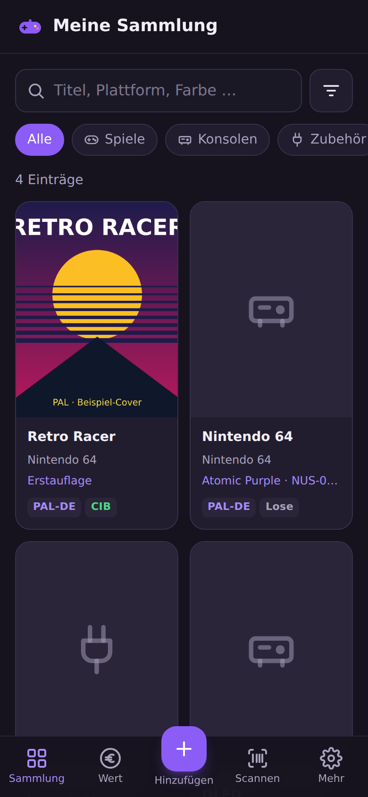
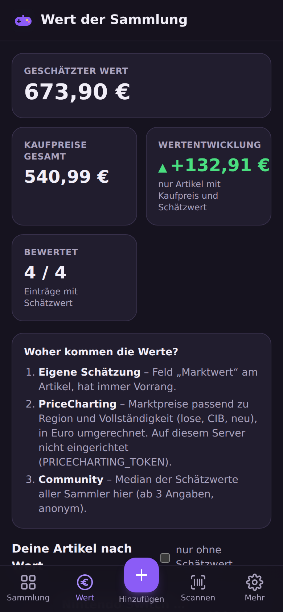
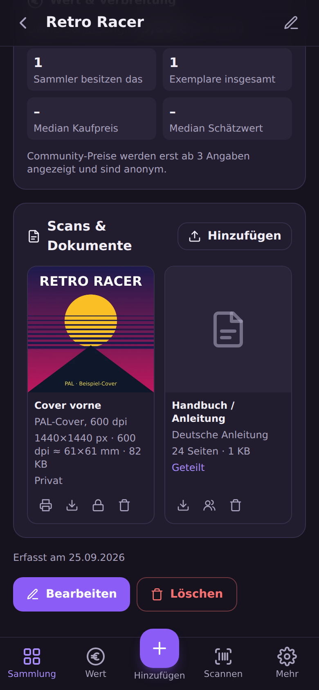
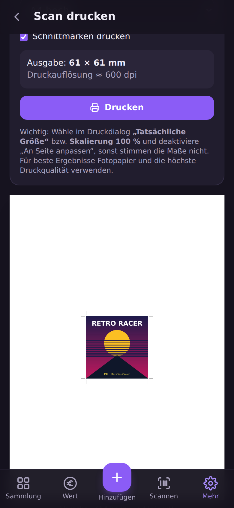

# 🎮 Videospielesammlung

**Deine Retro- und Videospielsammlung – selbst gehostet, mobil, auf Deutsch.**

Videospielesammlung ist eine quelloffene Progressive Web App (PWA) zur Verwaltung von
**Spielen, Konsolen und Zubehör** – für dich allein oder als öffentlich gehostete Plattform
mit vielen Benutzerkonten. Sie ist für Sammler im deutschsprachigen
Raum gemacht: PAL-/USK-Regionen, CIB-Status, Sonderfarben, Editionen und Modellrevisionen
lassen sich sauber erfassen – per Titelsuche, **Barcode-Scan mit der Handykamera** oder als
eigener Eintrag für Raritäten, die in keiner Datenbank stehen.

> 🇬🇧 An English version of this document is available in [README.en.md](README.en.md).

> 🔒 **Sicherheit hat höchste Priorität.** Du hast eine Sicherheitslücke gefunden? Ich freue mich über jeden Hinweis –
> bitte **vertraulich** über [GitHub Security Advisories](https://github.com/DrdotHouse2106/Videospielesammlung/security/advisories/new)
> melden. Details in der [Sicherheitsrichtlinie (SECURITY.md)](SECURITY.md).

<p align="center">
  
  &nbsp;
  
  &nbsp;
  
  &nbsp;
  
</p>

<sub>Screenshots der echten App mit Beispieldaten (das Cover „Retro Racer“ ist ein selbst gestaltetes Beispielbild).</sub>

---

## Inhalt

- [Funktionen](#funktionen)
- [Schnellstart mit Docker](#schnellstart-mit-docker)
- [Konfiguration (.env)](#konfiguration-env)
- [Benutzerkonten & Zwei-Faktor-Anmeldung](#benutzerkonten--zwei-faktor-anmeldung)
- [Wert & Marktpreise](#wert--marktpreise)
- [Scans, Handbücher & Cover nachdrucken](#scans-handbücher--cover-nachdrucken)
- [Globaler Katalog, Moderation & Rollen](#globaler-katalog-moderation--rollen)
- [Plattformen, Varianten & Exemplare](#plattformen-varianten--exemplare)
- [Preis-Historie](#preis-historie)
- [Affiliate-Links („Hier kaufen“)](#affiliate-links-hier-kaufen)
- [Administration & rechtliche Seiten](#administration--rechtliche-seiten)
- [Einstellungen über die Weboberfläche](#einstellungen-über-die-weboberfläche)
- [Suchmaschinen (SEO) & öffentliche Seiten](#suchmaschinen-seo--öffentliche-seiten)
- [Automatischer Preisimport (eBay)](#automatischer-preisimport-ebay)
- [KI-Vorprüfung (optional)](#ki-vorprüfung-optional)
- [Öffentlich hosten – Checkliste](#öffentlich-hosten--checkliste)
- [Sicherheit](#sicherheit)
- [IGDB-Zugang einrichten](#igdb-zugang-einrichten)
- [Barcode-Scanner & HTTPS](#barcode-scanner--https)
- [Betrieb im Internet (Reverse-Proxy)](#betrieb-im-internet-reverse-proxy)
- [Installation ohne Docker](#installation-ohne-docker)
- [Datensicherung & Updates](#datensicherung--updates)
- [Datenfelder](#datenfelder)
- [API-Überblick](#api-überblick)
- [Mitwirken](#mitwirken)
- [Lizenz](#lizenz)

---

## Funktionen

- **Benutzerkonten** mit Registrierung, sicherer Passwortspeicherung (scrypt) und
  **Zwei-Faktor-Anmeldung** per Authenticator-App (TOTP) inkl. Wiederherstellungscodes
- **Wert der Sammlung:** Schätzwert je Artikel und gesamt, Gewinn/Verlust gegenüber dem Kaufpreis,
  Marktpreise (optional über PriceCharting) und anonyme Community-Werte („12 Sammler besitzen das“)
- **Öffentliche Sammlungen:** Wer möchte, macht seine Sammlung für alle angemeldeten Benutzer sichtbar –
  Preise, Seriennummern und Notizen bleiben immer privat
- **Scans & Dokumente je Spiel:** hochauflösende Cover-Scans (auch TIFF), Handbücher als PDF, Modul-Labels –
  privat oder mit anderen Benutzern geteilt
- **Cover nachdrucken:** Druckansicht in Originalgröße (anhand der Scan-Auflösung) oder in fester Größe
  (z. B. DVD-Einleger), mit Schnittmarken
- **Globaler Katalog mit Moderation:** Nur Admins/Moderatoren nehmen Einträge direkt auf; Nutzer reichen ein
  oder behalten ihre Einträge privat. Duplikate lassen sich zusammenführen
- **Plattformen als feste Kategorien** (PS5, Switch, N64 …) nach Hersteller gruppiert – mit Filter-Chips
- **Varianten & Exemplare:** bekannte Modellnummern/Revisionen je Gerät als Sammel-Checkliste,
  mehrere Exemplare pro Spiel/Konsole, gruppierte Ansicht
- **Private Kommentare** zu jedem Spiel/Gerät
- **Preis-Historie:** automatischer Marktpreis-Verlauf und gemeldete Angebote/Verkäufe (wo, wann, wie viel)
- **Öffentliche Katalogseiten** mit „Hier kaufen“-Affiliate-Links (auch ohne Anmeldung)
- **Drei Artikeltypen:** Spiele, Konsolen/Systeme und Zubehör (Controller, Kabel, Memory Cards …)
- **Varianten:** Farbe/Sonderfarbe (z. B. „Clear Red“, „Atomic Purple“), Edition (z. B. „Zelda 25th Anniversary“),
  Modellnummer/Revision (z. B. „SCPH-1002“, „OLED“) und Seriennummer
- **Barcode-Scanner im Browser** (EAN-13, EAN-8, UPC-A, UPC-E) über die Kamera – ganz ohne App-Store
- **Online-Suche über IGDB** (Twitch-API) für Spiele und Konsolen, inkl. Cover, Erscheinungsjahr und Publisher
- **Eigene Katalogeinträge** für Hardware, Zubehör und seltene deutsche Exoten
- **Lernender Barcode-Cache:** Einmal zugeordnete Barcodes werden beim nächsten Scan sofort erkannt
- **Lokaler Cache** in SQLite – wiederholte Suchen sind blitzschnell und schonen API-Limits
- **Eigene Fotos** pro Artikel (z. B. vom Modul oder der OVP)
- **Filter & Suche** nach Typ, Plattform, Region, Zustand und Vollständigkeit
- **Statistik:** Anzahl, Kaufwert, Verteilung nach Plattform, Region, Zustand
- **Export/Import:** JSON (vollständige Sicherung) und CSV im deutschen Excel-Format
- **PWA:** Installierbar auf Android, iOS und Desktop; zuletzt geladene Daten auch offline sichtbar
- **Hell & dunkel:** folgt automatisch dem Farbschema des Geräts
- **Administration:** Benutzer sperren, Rollen vergeben, 2FA zurücksetzen, Registrierung schließen
- **Komplett auf Deutsch** – Oberfläche, Formulare, Meldungen und Dokumentation

**Technik:** Node.js 22 · Express 5 · SQLite (better-sqlite3) · sharp · React 19 · Vite · Tailwind CSS 4 · html5-qrcode

---

## Schnellstart mit Docker

Voraussetzung: [Docker](https://docs.docker.com/get-docker/) mit Docker Compose – oder eine Oberfläche wie
Portainer, Dockge oder den Container Manager einer Synology/QNAP.

**Du brauchst nur die Datei [`docker-compose.yml`](docker-compose.yml)** – kein `git clone`, kein Bauen.
Das fertige Image wird automatisch von der GitHub Container Registry geladen
(`ghcr.io/drdothouse2106/videospielesammlung`, für normale Server/PCs und ARM-Geräte wie Raspberry Pi).

1. Inhalt der [`docker-compose.yml`](docker-compose.yml) kopieren und als `docker-compose.yml` speichern
   bzw. in Portainer/Dockge als neuen **Stack** einfügen.
2. Die Einträge unter `environment:` anpassen (alle sind kommentiert; leere Werte `""` = Standard).
3. Starten:

```bash
docker compose up -d
```

Die App ist anschließend unter **<http://localhost:3000>** erreichbar. **Das erste Konto, das du
registrierst, wird Administrator.**

Nützliche Befehle:

```bash
docker compose logs -f                        # Protokoll ansehen
docker compose down                           # Anhalten (Daten bleiben erhalten)
docker compose pull && docker compose up -d   # Auf die neueste Version aktualisieren
```

In Portainer entspricht das Aktualisieren dem Knopf **„Update the stack“** mit aktivierter Option
**„Re-pull image“**.

Alle Daten (SQLite-Datenbank, Fotos, Scans und `geheimnis.key`) liegen im Docker-Volume
`sammlung-daten` und bleiben bei Updates und Neustarts erhalten.

### Nur die yml oder das Repository klonen?

Für den Betrieb ist **die yml mit Einträgen der bessere Weg**: Du lädst das geprüfte, fertige Image herunter
(die Tests laufen vorher automatisch auf GitHub), Updates sind ein einfaches `pull`, und alle Einstellungen stehen
übersichtlich an einer Stelle. Viele Werte lassen sich später zusätzlich in der App unter
*Administration → Einstellungen* ändern.

Klonen lohnt sich nur, wenn du **am Code etwas ändern** möchtest. Dann in der `docker-compose.yml` die Zeile
`image: …` durch `build: .` ersetzen und mit `docker compose up -d --build` starten.

Beide Wege lassen sich mischen: Statt der Einträge unter `environment:` kann auch eine `.env`-Datei neben der yml
liegen (`env_file: .env`). Für Portainer & Co. sind die Einträge in der yml aber am einfachsten.

### Die docker-compose.yml im Detail

| Eintrag | Bedeutung |
| --- | --- |
| `image` | Das fertige Image `ghcr.io/drdothouse2106/videospielesammlung:latest`. Für eine feste Version z. B. `:1.2` statt `:latest` verwenden. |
| `container_name` | Name des Containers (`videospielesammlung`), z. B. für `docker logs videospielesammlung`. |
| `restart: unless-stopped` | Startet den Container nach einem Absturz oder Neustart des Servers automatisch wieder – außer du hast ihn bewusst angehalten. |
| `ports: "3000:3000"` | Host-Port links, Port im Container rechts (immer 3000). Für Port 8080: `"8080:3000"`. |
| `volumes: sammlung-daten:/app/data` | Speichert Datenbank, Fotos, Scans und `geheimnis.key` dauerhaft im Docker-Volume. |
| `environment` | **Alle Einstellungen** als Einträge – gruppiert nach Konten & Sicherheit, öffentlichem Katalog, Uploads, IGDB, Preisen, Affiliate-Links und KI. Die Bedeutung jedes Werts steht als Kommentar darüber und in der Tabelle unter [Konfiguration](#konfiguration-env). |

Datenbankpfad, Upload-Ordner und interner Port sind im Image fest eingestellt und müssen nicht angegeben werden.
Ein **Healthcheck** (`GET /api/health`) ist ebenfalls im Image hinterlegt – `docker compose ps` bzw. Portainer
zeigen `healthy`, sobald die App bereit ist.

**Häufige Anpassungen:**

- **Hinter einem Reverse-Proxy** (Caddy, nginx, Traefik, Nginx Proxy Manager) auf demselben Server: Port nur lokal
  freigeben, damit die App nicht ohne HTTPS von außen erreichbar ist, und `TRUST_PROXY: "1"` setzen:
  ```yaml
  ports:
    - "127.0.0.1:3000:3000"
  ```
- **Daten in einem Ordner statt im Volume:** `- ./data:/app/data` statt `- sammlung-daten:/app/data` und einmalig
  `mkdir -p data && sudo chown 1000:1000 data` ausführen (der Container läuft als Benutzer 1000).
- **Dollarzeichen in Werten** (z. B. in Schlüsseln) doppelt schreiben: `$$`. Compose würde `$` sonst als Variable deuten.

> **Wichtig:** Die yml enthält API-Schlüssel – teile sie nicht öffentlich. Setze `APP_SECRET` einmalig
> (`openssl rand -base64 32`) und ändere es danach **nie** wieder – oder sichere `geheimnis.key` aus dem Volume.
> Ohne den Schlüssel lassen sich 2FA-Geheimnisse und in der App gespeicherte API-Schlüssel nicht mehr entschlüsseln.
> `docker compose down -v` löscht das Volume samt **allen Daten**. Wie du es sicherst, steht unter
> [Datensicherung & Updates](#datensicherung--updates).

> **Für den Betreiber des Repositorys:** Das Image wird bei jedem Push auf `main` (und bei Tags `v*`) von
> GitHub Actions gebaut und veröffentlicht. Nach dem ersten Lauf das Paket einmalig unter
> *GitHub → Profil → Packages → videospielesammlung → Package settings → Change visibility* auf **Public** stellen,
> damit es ohne Anmeldung heruntergeladen werden kann.

---

## Konfiguration (.env)

Die Grundkonfiguration erfolgt über Umgebungsvariablen – mit Docker als Einträge unter `environment:` in der
`docker-compose.yml`, ohne Docker in der Datei `.env`. Viele Werte können Administratoren zusätzlich unter
*Administration → Einstellungen* ändern (siehe [Einstellungen über die Weboberfläche](#einstellungen-über-die-weboberfläche)). Vorlage ist die Datei
[`.env.example`](.env.example) – kopiere sie nach `.env`. **Die `.env`-Datei enthält
Geheimnisse und wird durch `.gitignore` nie ins Repository übernommen.**

> Wo in dieser Anleitung „in die `.env` eintragen“ steht, gilt mit Docker: als Eintrag unter `environment:` in der
> `docker-compose.yml` eintragen (z. B. `REQUIRE_2FA: "true"`) und den Container mit `docker compose up -d` neu starten.

| Variable               | Standard                  | Beschreibung |
| ---------------------- | ------------------------- | ------------ |
| `PORT`                 | `3000`                    | Port des Servers (bei Docker: Port auf dem Host) |
| `DATABASE_PATH`        | `data/sammlung.db`        | Pfad zur SQLite-Datenbank (bei Docker fest `/app/data/sammlung.db`) |
| `UPLOAD_DIR`           | `data/uploads`            | Ordner für hochgeladene Fotos (bei Docker fest `/app/data/uploads`) |
| `MAX_UPLOAD_MB`        | `8`                       | Maximale Dateigröße für Artikelfotos |
| `MEDIA_MAX_MB`         | `200`                     | Maximale Dateigröße für Scans und PDF-Handbücher |
| `MEDIA_SHARING`        | `true`                    | Dürfen Scans mit anderen Benutzern geteilt werden? |
| `STORAGE_QUOTA_MB`     | `1024`                    | Speicherplatz je Benutzer für eigene Fotos und Scans in MB (`0` = unbegrenzt) |
| `CACHE_TTL_HOURS`      | `168`                     | Gültigkeit zwischengespeicherter Online-Suchen (Stunden) |
| `TWITCH_CLIENT_ID`     | –                         | Client-ID für IGDB (siehe unten) |
| `TWITCH_CLIENT_SECRET` | –                         | Client-Secret für IGDB |
| `BARCODE_PROVIDERS`    | `opengtindb,upcitemdb`    | Reihenfolge der Barcode-Datenbanken; leer = nur lokal gelernte Barcodes |
| `OPENGTINDB_QUERYID`   | –                         | Zugangsnummer für [opengtindb.org](https://opengtindb.org) (deutsche EAN-Datenbank) |
| `REGISTRATION_OPEN`    | `true`                    | Dürfen sich neue Benutzer selbst registrieren? |
| `REGISTRATIONS_PER_HOUR` | `5`                     | Max. Registrierungen pro IP-Adresse und Stunde |
| `REQUIRE_2FA`          | `false`                   | Zwei-Faktor-Anmeldung für alle Benutzer verpflichtend |
| `SESSION_DAYS`         | `30`                      | Gültigkeit einer Anmeldung in Tagen (verlängert sich bei Nutzung) |
| `COOKIE_SECURE`        | `auto`                    | Sitzungs-Cookie nur über HTTPS (`auto`, `true`, `false`) |
| `APP_SECRET`           | automatisch               | Schlüssel zum Verschlüsseln der 2FA-Geheimnisse; leer = wird erzeugt und in `data/geheimnis.key` gespeichert |
| `PRICECHARTING_TOKEN`  | –                         | API-Token für Marktpreise von [PriceCharting](https://www.pricecharting.com) |
| `USD_EUR_RATE`         | EZB-Tageskurs             | Fester Umrechnungskurs USD → EUR |
| `PRICE_CACHE_HOURS`    | `72`                      | Gültigkeit abgerufener Marktpreise |
| `TRUST_PROXY`          | –                         | Hinter einem Reverse-Proxy `1` setzen (für HTTPS-Cookies und IP-basierte Sperren) |
| `PUBLIC_CATALOG`       | `true`                    | Katalogseiten ohne Anmeldung zeigen (Sammlungen bleiben privat) – Voraussetzung für Suchmaschinen |
| `PUBLIC_URL`           | –                         | Öffentliche Adresse, z. B. `https://sammlung.example.de` (Canonical-Links, Sitemap) |
| `LINK_DOMAINS`         | –                         | Links zu Cover-/Handbuch-Seiten nur zu diesen Domains erlauben (kommagetrennt) |
| `EBAY_CLIENT_ID` / `EBAY_CLIENT_SECRET` | –        | Zugang zur offiziellen eBay Browse API für den automatischen Preisimport |
| `EBAY_MARKETPLACE` / `EBAY_ITEM_LOCATION` | `EBAY_DE` / `DE` | Marktplatz und Artikelstandort der eBay-Suche |
| `EBAY_CATEGORY_IDS`    | –                         | Optional: eBay-Kategorien eingrenzen (kommagetrennt) |
| `PRICE_IMPORT_HOURS`   | `24`                      | Automatischer Preisimport alle X Stunden (`0` = aus) |
| `PRICE_IMPORT_MAX`     | `150`                     | Max. Katalogeinträge pro Import-Durchlauf |
| `AI_PROVIDER`          | `aus`                     | KI-Vorprüfung: `anthropic`, `gemini`, `openai` (auch kompatible/lokale Modelle) oder `aus` |
| `AI_API_KEY` / `AI_MODEL` / `AI_BASE_URL` | –       | Zugangsdaten, Modell und (für OpenAI-kompatible Dienste) Adresse |
| `AI_AUTO_APPROVE` / `AI_AUTO_REJECT` | `true`       | Darf die KI selbst freigeben bzw. ablehnen? |
| `AI_MIN_CONFIDENCE`    | `0.85`                    | Mindest-Sicherheit für automatische Entscheidungen |
| `AFFILIATE_LINKS`      | `true`                    | „Hier kaufen“-Links anzeigen |
| `AFFILIATE_AMAZON_TAG` | aus dem Code              | Amazon-PartnerNet-ID (überschreibt `server/affiliate-konfiguration.js`) |
| `AFFILIATE_EBAY_CAMPID`| aus dem Code              | eBay-Partner-Network-Kampagnen-ID |

Ohne IGDB-Zugangsdaten funktioniert die App vollständig – die Online-Suche entfällt dann,
und du legst Artikel als eigene Einträge an.

---

## Benutzerkonten & Zwei-Faktor-Anmeldung

- **Registrierung:** Jeder kann sich selbst ein Konto anlegen (abschaltbar mit `REGISTRATION_OPEN=false`).
  Das **erste** Konto wird Administrator – auch bei geschlossener Registrierung.
- **Passwörter** werden mit scrypt gehasht gespeichert (mindestens 10 Zeichen).
- **Zwei-Faktor-Anmeldung (2FA):** Unter *Mehr → Konto & Sicherheit → 2FA einrichten* den QR-Code mit
  einer Authenticator-App scannen (z. B. Aegis, 2FAS, Google/Microsoft Authenticator, Bitwarden, 1Password).
  Danach werden **10 Wiederherstellungscodes** angezeigt – sicher aufbewahren! Jeder Code funktioniert einmal,
  falls das Handy verloren geht.
- **2FA-Pflicht:** Mit `REQUIRE_2FA=true` müssen alle Benutzer die 2FA einrichten, bevor sie die App nutzen können.
- **Schutzmaßnahmen:** Begrenzung von Fehlversuchen (Anmeldung, 2FA-Codes, Registrierung), HttpOnly-/SameSite-Cookies,
  Prüfung der Herkunft bei ändernden Anfragen (CSRF-Schutz), Content-Security-Policy, verschlüsselt gespeicherte 2FA-Geheimnisse.
- **Administration** (*Mehr → Benutzerverwaltung*): Konten sperren, Admin-Rechte vergeben, Passwort neu setzen,
  2FA zurücksetzen (z. B. wenn jemand Handy und Wiederherstellungscodes verloren hat) und Konten löschen.
- **Passwort vergessen?** Es gibt bewusst keinen E-Mail-Versand. Ein Administrator kann ein neues Passwort setzen.

> **Upgrade von Version 1:** Bestehende Artikel werden beim ersten Registrieren automatisch dem ersten
> (Administrator-)Konto zugeordnet. Die alten Variablen `AUTH_USER`/`AUTH_PASSWORD` entfallen.

---

## Globaler Katalog, Moderation & Rollen

Jeder Artikel in einer Sammlung gehört zu einem **Katalogeintrag** (das „Spiel“ bzw. „Gerät“ an sich).

| Status | Wer sieht ihn? |
| --- | --- |
| **Privat** | Nur der Ersteller – Standard für eigene Einträge |
| **Eingereicht** | Ersteller + Moderationsteam (wartet auf Prüfung) |
| **Freigegeben** | Alle – Teil der globalen Datenbank |
| **Abgelehnt** | Nur der Ersteller, mit Begründung; kann überarbeitet und erneut eingereicht werden |

- **Rollen:** *Nutzer*, *Moderator*, *Administrator* (Rollen vergibt der Admin unter *Mehr → Benutzerverwaltung*).
- **Nur Moderatoren und Admins** können Einträge direkt im globalen Katalog veröffentlichen, freigegebene Einträge
  bearbeiten, Plattformen pflegen und Kauflinks hinterlegen.
- **Nutzer** legen Einträge privat an oder reichen sie ein (beim Hinzufügen oder später über „Einreichen“).
- **Moderation** (*Mehr → Moderation*): Einreichungen von Katalogeinträgen, Varianten und Scans freigeben oder mit Begründung
  ablehnen. **Duplikate zusammenführen** übernimmt alle Artikel, Scans, Kommentare und Preisdaten in den bestehenden Eintrag.
- IGDB-Treffer gelten als geprüfte Quelle und sind automatisch freigegeben.
- **Barcodes** werden je Benutzer gelernt – ein Barcode verrät nie einen privaten Eintrag eines anderen.

> **Upgrade:** Bestehende eigene Katalogeinträge von Nicht-Admins landen einmalig in der Moderations-Warteschlange,
> bisher „geteilte“ Scans ebenfalls.

---

## Plattformen, Varianten & Exemplare

- **Plattformen** sind feste Kategorien mit Kürzel und Hersteller (z. B. *PS5 – PlayStation 5 – Sony*). Rund 40 Systeme
  sind vorinstalliert; Moderatoren ergänzen weitere unter *Moderation → Plattformen* (inkl. alternativer Namen, damit
  z. B. „Genesis“ automatisch dem Mega Drive zugeordnet wird). In der Sammlung filterst du per Plattform-Chip,
  der **Katalog** ist nach Hersteller und Plattform gegliedert.
- **Varianten/Revisionen:** Zu jedem Katalogeintrag gibt es eine Liste bekannter Varianten (Modellnummer, Farbe, Edition,
  Region, Jahr) – z. B. *SCPH-1002, SCPH-5552, SCPH-9002, PSone*. Die Liste dient als **Sammel-Checkliste**: Du siehst,
  welche Revisionen dir noch fehlen. Nutzer schlagen Varianten vor, Moderatoren geben sie frei.
- **Mehrere Exemplare:** Über *Weiteres Exemplar / Variante* legst du ein zweites Exemplar mit übernommenen Grunddaten an
  und wählst nur noch die Variante. In der Sammlung werden Exemplare desselben Eintrags zu einer Karte gruppiert
  (abschaltbar im Filter).

---

## Administration & rechtliche Seiten

Administratoren finden unter **Mehr → Administration**:

- **Übersicht:** Benutzer, Moderationsteam, 2FA-Quote, offene Prüfungen und Meldungen, Katalog- und Preisdaten, Status aller Dienste.
- **Benutzer & Rollen:** Suchen, nach Rolle filtern, **„Zum Moderator machen“**, Rollen ändern, sperren, 2FA zurücksetzen, Passwort setzen, löschen.
- **Rechtliches:** **Impressum, Datenschutzerklärung, Nutzungsbedingungen und Sicherheit** direkt in der App bearbeiten
  (einfaches Markdown mit Vorschau). Die Seiten sind ohne Anmeldung erreichbar und auf jeder Seite in der Fußzeile verlinkt.
  Mitgeliefert werden **Vorlagen** passend zu den Funktionen der App – bitte alle Angaben in [eckigen Klammern] ersetzen
  (die Vorlagen sind keine Rechtsberatung).
- **Einstellungen:** Server-Einstellungen (Registrierung, 2FA-Pflicht, Speicher, KI, Preisimport, API-Schlüssel …) ohne Neustart ändern – siehe unten.
- **Preisimport:** Status und manueller Start des automatischen Preisimports.

Bei der Registrierung bestätigen neue Benutzer die Nutzungsbedingungen und die Kenntnisnahme der Datenschutzerklärung.

**Moderatoren** bearbeiten unter *Mehr → Moderation* bzw. direkt auf jeder Katalogseite (Stift-Symbol) alle Katalogeinträge –
auch aus IGDB übernommene (diese werden dann bei späteren Importen nicht mehr überschrieben) – sowie Varianten, Plattformen und Kauflinks.

### Einstellungen über die Weboberfläche

Unter *Administration → Einstellungen* ändern Administratoren viele Werte der `.env` direkt in der App:

- **Konten & Sicherheit:** Registrierung offen, 2FA-Pflicht
- **Uploads & Speicher:** Speicherkontingent, maximale Dateigrößen, Teilen von Scans
- **Öffentlicher Katalog & Suchmaschinen:** öffentlicher Katalog, `PUBLIC_URL`, erlaubte Link-Domains
- **KI-Vorprüfung:** Anbieter, Modell, Basis-URL, API-Schlüssel, Schwellwert, automatische Freigabe/Ablehnung
- **Preise & Angebote:** Importintervall, Einträge pro Lauf, eBay- und PriceCharting-Zugangsdaten
- **Spieledaten & Barcodes:** IGDB-/Twitch-Zugangsdaten, Barcode-Dienste, OpenGTINDB-Query-ID

So funktioniert es:

- Die `.env` bleibt die **Grundeinstellung**. In der Oberfläche gesetzte Werte werden in der Datenbank gespeichert und
  haben **Vorrang**. Bei jedem Wert steht, woher er stammt (*Standard*, *.env* oder *Weboberfläche*);
  „Auf .env-Wert zurücksetzen“ entfernt den Wert wieder aus der Datenbank.
- Änderungen wirken **sofort** – betroffene Dienste (IGDB, eBay, PriceCharting, KI, Barcode-Suche, Preisimport) werden
  automatisch neu gestartet.
- **API-Schlüssel** werden mit AES-256-GCM verschlüsselt gespeichert (Schlüssel aus `APP_SECRET` bzw. `data/geheimnis.key`)
  und nie wieder im Klartext angezeigt – nur gekürzt als `••••1234`. Ein leeres Feld lässt den Schlüssel unverändert,
  „Schlüssel entfernen“ löscht ihn.
- **Sicherheitsrelevante Änderungen** (Schlüssel, Registrierung, 2FA-Pflicht, KI-Anbieter und -Adresse) erfordern das eigene
  **Passwort** und – falls aktiviert – einen **2FA-Code**. Fehlversuche werden begrenzt.
- Jede Änderung landet im **Änderungsprotokoll** (wer, wann, alter → neuer Wert; Schlüssel nur gekürzt).
- **Nur über die `.env`** änderbar bleiben `APP_SECRET`, `DATABASE_PATH`, `UPLOAD_DIR`, `PORT`, `HOST`, `TRUST_PROXY`,
  `COOKIE_SECURE`, `SESSION_DAYS` und `REGISTRATIONS_PER_HOUR` – eine Fehleinstellung dort könnte den Server aussperren
  oder unsicher machen.

> **Hinweis:** Wird `APP_SECRET` geändert (oder `data/geheimnis.key` gelöscht), können in der Oberfläche gespeicherte
> Schlüssel nicht mehr entschlüsselt werden – dann gilt wieder der Wert aus der `.env`, und die Schlüssel müssen neu eingegeben werden.

### Meldungen (Notice-and-Takedown)

Jeder – auch ohne Konto – kann öffentliche Inhalte über **„Melden“** melden (z. B. Urheberrechtsverletzung, falsche Angaben);
angemeldete Benutzer können zusätzlich freigegebene Scans melden. Meldungen erscheinen im Moderationsbereich unter **„Meldungen“**
und können mit „Inhalt entfernen“ oder „Kein Verstoß“ abgeschlossen werden. Entfernte Scans sind für andere sofort gesperrt;
der Uploader behält sie privat.

---

## Automatischer Preisimport (eBay)

Mit einem **kostenlosen eBay-Developer-Zugang** holt die App regelmäßig automatisch aktuelle Angebote:

1. Unter <https://developer.ebay.com> registrieren → *Application Keys* → Keyset für **Production** erzeugen.
2. `EBAY_CLIENT_ID` (App ID) und `EBAY_CLIENT_SECRET` (Cert ID) in die `.env` eintragen.
3. Optional die eBay-Partner-Kampagnen-ID (`AFFILIATE_EBAY_CAMPID` bzw. im Code) setzen – dann liefert eBay die
   Angebotslinks direkt als **Affiliate-Links**.

Der Import läuft alle `PRICE_IMPORT_HOURS` Stunden (erstmals 5 Minuten nach dem Start) für alle freigegebenen Katalogeinträge,
die jemand sammelt – zuerst die am längsten nicht aktualisierten. Pro Eintrag werden die aktuellen Festpreis-Angebote aus Deutschland
gesucht, unpassende Treffer (anderer Titel, „nur Hülle“, Repros) und Preis-Ausreißer verworfen und der **Median** mit Datum in der
Preis-Historie gespeichert. Die günstigsten Angebote erscheinen auf der öffentlichen Katalogseite unter „Hier zum Kauf verfügbar“.
Ist `PRICECHARTING_TOKEN` gesetzt, werden im selben Durchlauf auch die Marktpreise aktualisiert.

> **Warum nur eBay?** eBay bietet eine offizielle, kostenlose API. Kleinanzeigen, Vinted und die meisten Händler bieten keine
> öffentliche Schnittstelle; automatisches Auslesen ihrer Seiten („Scraping“) verstößt in der Regel gegen deren Nutzungsbedingungen
> und ist deshalb nicht eingebaut. Solche Angebote können Nutzer weiterhin manuell melden. Verkaufte (statt angebotene) Artikel liefert
> eBay nur über die zugangsbeschränkte „Marketplace Insights API“.

---

## KI-Vorprüfung (optional)

Wenn viele Einreichungen anfallen, kann eine KI **eingereichte Katalogeinträge und Varianten vorprüfen**. Der Anbieter ist frei wählbar:
**Claude** (Anthropic), **Gemini** (Google) oder jeder **OpenAI-kompatible** Dienst – z. B. OpenAI, Mistral, OpenRouter oder ein
**lokales Modell** über Ollama/LM Studio (dann verlassen keine Daten deinen Server).

```env
AI_PROVIDER=anthropic          # oder gemini / openai
AI_API_KEY=...
AI_MODEL=                      # bei anthropic optional (Standard: claude-opus-5; günstiger z. B. claude-haiku-4-5)
# AI_BASE_URL=http://ollama:11434/v1   # nur für OpenAI-kompatible/lokale Dienste
```

**So funktioniert es:**

1. Die KI erhält nur die Daten der Einreichung (Titel, Plattform, Jahr, Beschreibung …) und ähnliche vorhandene Einträge –
   **keine Benutzernamen oder sonstigen Kontodaten**.
2. Sie schlägt *freigeben*, *ablehnen* oder *unklar* samt Begründung und Sicherheit vor.
3. **Nur bei ausreichender Sicherheit** (`AI_MIN_CONFIDENCE`) wird automatisch entschieden. Unsichere Fälle, mögliche Duplikate,
   Einreichungen mit Links oder Anweisungen an die KI sowie alle Fehler landen beim Moderationsteam – mit der Einschätzung der KI als Hinweis.
4. Automatische Entscheidungen sind für den Einreicher **klar gekennzeichnet** („Automatisch durch KI abgelehnt: …“ mit Begründung).
   Er kann jederzeit eine **menschliche Überprüfung anfordern**; danach entscheidet ausschließlich ein Moderator.
5. Jede Prüfung steht im **KI-Protokoll** (*Moderation → KI-Protokoll*); Moderatoren können automatische Entscheidungen zurücknehmen.
6. **Scans und Dokumente werden nie automatisch freigegeben** – die Rechtelage kann eine KI nicht zuverlässig beurteilen.

**Rechtliche Hinweise für Betreiber** (keine Rechtsberatung):

- **Datenschutz:** Mit einem externen KI-Anbieter einen Auftragsverarbeitungsvertrag (AVV/DPA) abschließen, die Übermittlung
  (z. B. in die USA) in der Datenschutzerklärung nennen und keine kostenlosen Tarife nutzen, die Eingaben zum Training verwenden.
  Mit einem lokalen Modell entfällt die Übermittlung.
- **Digital Services Act:** In den Nutzungsbedingungen offenlegen, dass automatisierte Werkzeuge zur Moderation eingesetzt werden
  (Art. 14 DSA), und bei Ablehnungen die Begründung inkl. Hinweis auf die automatisierte Entscheidung sowie den Weg zur
  Überprüfung nennen (Art. 17 DSA) – beides ist eingebaut bzw. in den Vorlagen enthalten.
- **Haftung:** Eine KI-Freigabe gilt rechtlich wie eine Freigabe durch das Moderationsteam.

---

## Preis-Historie

Die Katalogseite jedes Spiels zeigt einen **Preisverlauf**:

- **Marktpreise** (lose/CIB/neu) werden bei jedem Abruf von PriceCharting automatisch mit Datum gespeichert – so entsteht mit der Zeit ein Verlauf.
- **eBay-Angebote:** Der automatische Preisimport speichert täglich den Median der aktuellen Angebote.
- **Meldungen:** Angemeldete Nutzer melden, **wo** (eBay, Kleinanzeigen, Vinted, Händler, Börse …), **wann** und **für wie viel** ein
  Artikel **angeboten** oder **verkauft** wurde – optional mit Link, Zustand, Vollständigkeit und Region.
- Meldungen sind für andere **anonym**; eigene Meldungen kann man löschen, Moderatoren alle.

---

## Affiliate-Links („Hier kaufen“)

Auf Katalogseiten erscheint – deutlich als **Anzeige** gekennzeichnet – ein Bereich „Hier zum Kauf verfügbar“:

1. **Suchlinks** zu Amazon und eBay mit Partner-ID, automatisch für jedes Spiel.
2. **Direktlinks**, die Moderatoren je Spiel hinterlegen (beliebiger Shop, z. B. mit eigenem Partnerlink).

Die **Standard-Partner-IDs stehen im Code** in [`server/affiliate-konfiguration.js`](server/affiliate-konfiguration.js)
und gelten damit für jede Installation, die sie nicht ändert. Betreiber können sie per `.env` überschreiben
(`AFFILIATE_AMAZON_TAG`, `AFFILIATE_EBAY_CAMPID`) oder abschalten (`AFFILIATE_LINKS=false`).

> **Wichtig für Betreiber:** Affiliate-Links sind Werbung und werden in der Oberfläche als „Anzeige“ markiert
> (Kennzeichnungspflicht nach UWG). Prüfe außerdem die Teilnahmebedingungen deines Partnerprogramms –
> manche Programme erlauben Links nur auf Websites, die im Partnerkonto angemeldet sind.

---

## Wert & Marktpreise

Die Seite **Wert** zeigt den geschätzten Wert deiner Sammlung, die Summe der Kaufpreise und die
Wertentwicklung. Jeder Artikel bekommt seinen Schätzwert aus der ersten verfügbaren Quelle:

1. **Eigene Schätzung** – Feld „Marktwert“ am Artikel (hat immer Vorrang).
2. **PriceCharting** (optional, `PRICECHARTING_TOKEN`) – Marktpreise passend zu Region (PAL/NTSC/JP) und
   Vollständigkeit (lose, CIB, neu, nur OVP). Die Preise kommen in US-Dollar und werden mit dem Tageskurs
   der Europäischen Zentralbank in Euro umgerechnet. PriceCharting erfordert ein kostenpflichtiges Abo mit API-Zugang.
3. **Community** – Median der Schätzwerte aller Sammler auf deinem Server.

Auf der Detailseite jedes Spiels siehst du außerdem, **wie viele Sammler es besitzen**, wie viele Exemplare es
insgesamt gibt und – ab drei Angaben, damit niemand einzeln zurückverfolgt werden kann – den Median von Kauf- und
Schätzpreisen.

> Hinweis: Es gibt keine kostenlose, offizielle Preisdatenbank für den deutschen Markt. Alle Werte sind Schätzungen
> ohne Gewähr.

---

## Scans, Handbücher & Cover nachdrucken

Auf der Detailseite eines Artikels kannst du unter **Scans & Dokumente** Dateien hochladen:

| Art | Formate |
| --- | --- |
| Cover vorne, Cover hinten, Cover komplett (Inlay), Modul-/Disc-Label | JPG, PNG, WebP, **TIFF** |
| Handbuch/Anleitung, Sonstiges | zusätzlich **PDF** |

- Das **Original bleibt unverändert** gespeichert und kann jederzeit heruntergeladen werden.
  TIFF-Scans werden zusätzlich in eine browsertaugliche JPG-Version in voller Auflösung umgewandelt.
- Die **Scan-Auflösung (dpi)** wird aus der Datei gelesen (oder beim Hochladen angegeben).
- Scans hängen am **Spiel** (Katalogeintrag), nicht an deinem Exemplar.
- **Sichtbarkeit:** *Nur für mich* (Standard) oder *zur Freigabe einreichen*. Nach Prüfung durch das Moderationsteam sehen alle
  angemeldeten Benutzer den Scan – **deutlich gekennzeichnet als „Nutzer-Upload von …“ mit Prüfdatum**.
  Mit `MEDIA_SHARING=false` ist das Einreichen serverweit abgeschaltet.
- **Speicherplatz:** Jeder Benutzer hat ein Kontingent für eigene Uploads (Standard **1 GB**, `STORAGE_QUOTA_MB`).
  Gezählt werden Artikelfotos sowie private, eingereichte und abgelehnte Scans – jeweils inklusive der automatisch
  erzeugten Anzeige- und Vorschaubilder. **Freigegebene Scans** gehören zur gemeinsamen Datenbank und zählen nicht mehr mit.
  Ist der Speicher voll, werden weitere Uploads mit einem Hinweis abgelehnt (bereits vor der Übertragung, wenn die
  Datei erkennbar zu groß ist). Die Belegung steht unter *Konto & Sicherheit* und im Upload-Formular.
  Administratoren sehen die Belegung aller Benutzer und können das Limit je Benutzer anpassen (`0` = unbegrenzt);
  für Administratoren selbst gilt standardmäßig kein Limit.

**Drucken:** Über das Drucker-Symbol öffnet sich die Druckansicht:

- **Originalgröße** – ein mit 600 dpi gescanntes Cover wird exakt so groß gedruckt wie das Original.
- **Feste Größe** – z. B. DVD-Einleger 273 × 183 mm; Seitenverhältnis wahlweise beibehalten.
- **Seitenfüllend**, Papier A4/A3/Letter hoch oder quer, optionale **Schnittmarken**.
- Die Ansicht zeigt die effektive Druckauflösung und warnt, wenn sie unter 200 dpi fällt.
- Im Druckdialog **„Tatsächliche Größe“ bzw. 100 %** wählen, sonst skaliert der Browser.

### Links statt Dateien: Cover & Handbücher im Netz

Rechtlich deutlich risikoärmer als eigene Uploads: Auf jeder Spielseite gibt es den Bereich **„Cover & Handbücher im Netz“**.
Nutzer hinterlegen dort Links **direkt zum Cover oder Handbuch** auf anderen Webseiten (z. B. beim Hersteller oder in einem offiziellen Archiv):

- **Privat** als persönliches Lesezeichen oder **für alle vorschlagen** – vorgeschlagene Links erscheinen erst nach Freigabe
  durch das Moderationsteam (*Moderation → Links*), dann auch öffentlich ohne Anmeldung.
- Nur sichere `https://`-Adressen; optional nur freigegebene Domains (`LINK_DOMAINS`).
- Links öffnen die fremde Seite in einem neuen Tab (kein Einbetten), jeder freigegebene Link kann gemeldet werden.

> ⚖️ Nach der Rechtsprechung des EuGH ist das Verlinken frei zugänglicher Inhalte grundsätzlich zulässig – **nicht** aber,
> wenn man weiß oder wissen muss, dass die verlinkte Seite Inhalte ohne Erlaubnis anbietet. Bei Seiten mit Gewinnerzielungsabsicht
> (z. B. mit Affiliate-Links) wird diese Kenntnis sogar vermutet. Deshalb gibt es die Moderation und optional `LINK_DOMAINS`:
> Nur Links zu Quellen freigeben, die die Inhalte rechtmäßig anbieten.

**Tipp zum Scannen:** Mindestens 600 dpi, Farbmodus 24 Bit, als TIFF oder PNG speichern (verlustfrei).
Für ein DVD-Inlay reicht ein A4-Scanner; größere Einleger in zwei Teilen scannen.

> ⚖️ **Urheberrecht:** Cover, Artwork und Handbücher sind urheberrechtlich geschützt. Private Sicherungskopien
> deiner eigenen Originale sind in Deutschland in engen Grenzen erlaubt (§ 53 UrhG). Das **Teilen** mit anderen
> Benutzern auf einem öffentlichen Server kann darüber hinausgehen – als Betreiber solltest du prüfen, ob du
> `MEDIA_SHARING` aktivierst.

---

## Suchmaschinen (SEO) & öffentliche Seiten

Die App selbst nutzt Adressen mit `#` (z. B. `/#/katalog/42`) – diese sieht Google nicht als eigene Seiten. Deshalb erzeugt
der Server für den öffentlichen Katalog **eigene, schnelle HTML-Seiten ohne JavaScript**:

| Adresse | Inhalt |
| --- | --- |
| `/spiel/42-super-mario-64-n64` | Spieleseite (Konsolen: `/konsole/…`, Zubehör: `/zubehoer/…`) |
| `/plattform/n64` | Alle Einträge einer Plattform, sortiert nach Anzahl der Sammler |
| `/plattformen` | Übersicht aller Plattformen |
| `/sitemap.xml` | Sitemap-Index (Plattformen + Katalogseiten, je 40.000 Adressen) |
| `/robots.txt` | Erlaubt alles außer `/api/`, verweist auf die Sitemap |

**Welche Spiele bekommen eine Seite?** Seiten werden erst beim Aufruf erzeugt – es wird nichts vorab gespeichert.
Treffer aus der IGDB-Suche landen zwar im Katalog, sind für Suchmaschinen aber **gesperrt** (`noindex`, nicht in der Sitemap).
**Indexierbar** ist ein Eintrag nur, wenn er freigegeben ist **und**

- mindestens ein Benutzer ihn in seiner Sammlung hat **oder** das Moderationsteam ihn gepflegt hat
  (eigener freigegebener Eintrag, Sammlerhinweise, freigegebene Scans oder Links), **und**
- er nicht „dünn“ ist (Beschreibung, Sammlerhinweise, Cover oder Preisdaten vorhanden).

So wächst die Zahl der Seiten nur mit den echten Sammlungen – leere Seiten schaden sonst dem Ranking der ganzen Domain.

**Was steht auf einer Spieleseite?** Cover, Plattformen, Jahr, Hersteller, **wie viele Sammler das Spiel besitzen**
(anonym), ein **Wert-Abschnitt** aus den Preisdaten der letzten 90 Tagen („im Schnitt 38 €, Spanne 25–60 €“),
Beschreibung, **Sammlerhinweise**, Varianten, Links zu Cover/Handbüchern, Anzahl der Scans (sichtbar nach Anmeldung) und
„Hier kaufen“ (als **Anzeige** gekennzeichnet, Links mit `rel="sponsored"`). Der Knopf „In meine Sammlung“ führt in die App.

**Automatische Metadaten:** Seitentitel, Beschreibung, Canonical-Link, Open Graph (Vorschau beim Teilen) und strukturierte
Daten (`VideoGame` bzw. `Product`, `BreadcrumbList`, `AggregateOffer` nur aus echten aktuellen Angeboten) entstehen
automatisch aus der Datenbank. Moderatoren können Titel und Beschreibung im Bearbeiten-Formular unter
*Suchmaschinen* überschreiben.

**Sammlerhinweise** (Markdown) pflegt das Moderationsteam am Katalogeintrag – z. B. PAL-/USK-Versionen, Lieferumfang,
Revisionen, Fälschungsmerkmale. Eigene Worte statt kopierter Texte sind der wichtigste Faktor für ein gutes Ranking.
Benutzer schlagen Ergänzungen über „Sammlerhinweis oder Korrektur vorschlagen“ vor; die Vorschläge erscheinen im
Moderationsbereich unter *Meldungen*.

**Einrichten:**

1. `PUBLIC_CATALOG=true` und `PUBLIC_URL=https://deine-domain.de` setzen (auch unter *Administration → Einstellungen*).
2. Domain in der [Google Search Console](https://search.google.com/search-console) und bei
   [Bing Webmaster Tools](https://www.bing.com/webmasters) bestätigen und `https://deine-domain.de/sitemap.xml` einreichen.
3. Sammlerhinweise für beliebte Spiele pflegen und die Seite in Retro-Communitys bekannt machen.

Alte Links auf `/#/katalog/42` leiten Besucher ohne Anmeldung automatisch auf die öffentliche Seite weiter.

## Öffentlich hosten – Checkliste

1. Reverse-Proxy mit **HTTPS** einrichten (siehe unten) und `TRUST_PROXY=1` setzen.
2. Zuerst selbst registrieren → du wirst Administrator.
3. Entscheiden: `REGISTRATION_OPEN` (offen für alle) und `REQUIRE_2FA` (2FA-Pflicht, empfohlen).
4. Rollen vergeben: vertrauenswürdige Nutzer zu **Moderatoren** machen.
5. Optional `APP_SECRET` setzen (`openssl rand -base64 32`) – sonst unbedingt `data/geheimnis.key` mitsichern.
6. `MEDIA_SHARING` bewusst wählen (siehe Urheberrecht oben).
7. **Regelmäßige Backups** des Datenverzeichnisses einrichten.
8. Affiliate-IDs in `server/affiliate-konfiguration.js` eintragen (oder per `.env`).
9. Unter *Administration → Rechtliches* **Impressum, Datenschutzerklärung, Nutzungsbedingungen und Sicherheit** ausfüllen.
10. Meldungen im Moderationsbereich regelmäßig und zeitnah bearbeiten.
11. Für Suchmaschinen `PUBLIC_URL` setzen und die Sitemap einreichen (siehe [SEO](#suchmaschinen-seo--öffentliche-seiten)).
12. Impressum/Datenschutzerklärung: Bei einem öffentlich erreichbaren Angebot in Deutschland in der Regel Pflicht –
   z. B. als eigene Seite über den Reverse-Proxy bereitstellen.

---

## IGDB-Zugang einrichten

[IGDB](https://www.igdb.com) ist eine umfangreiche, kostenlose Spieldatenbank von Twitch.

1. Melde dich unter <https://dev.twitch.tv/console> mit einem Twitch-Konto an
   (Zwei-Faktor-Authentifizierung muss aktiviert sein).
2. **Anwendungen → Deine Anwendung registrieren**
   - Name: frei wählbar, z. B. `Meine Videospielesammlung`
   - OAuth-Redirect-URL: `http://localhost`
   - Kategorie: `Application Integration`
   - Client-Typ: `Vertraulich`
3. Öffne die Anwendung, kopiere die **Client-ID** und erzeuge ein **neues Geheimnis** (Client-Secret).
4. Trage beide Werte in die `.env` ein und starte neu:

   ```env
   TWITCH_CLIENT_ID=abc123...
   TWITCH_CLIENT_SECRET=xyz789...
   ```

Unter **Mehr → Status** siehst du, ob die Online-Suche aktiv ist.

### Wie funktioniert die Barcode-Suche?

IGDB kennt keine Barcodes. Die App geht deshalb in Stufen vor:

1. **Lokal:** Wurde der Barcode schon einmal einem Artikel zugeordnet, wird er sofort erkannt.
2. **Barcode-Datenbank:** Über [opengtindb.org](https://opengtindb.org) (deutsch, Zugangsnummer nötig)
   bzw. [upcitemdb.com](https://www.upcitemdb.com) (Testzugang, max. 100 Abfragen/Tag) wird der Produktname ermittelt.
3. **IGDB:** Der Produktname wird bereinigt (z. B. „Super Mario Odyssey - [Nintendo Switch] USK 6“ → „Super Mario Odyssey“)
   und bei IGDB gesucht.
4. **Nichts gefunden?** Dann suchst du manuell oder legst einen eigenen Eintrag an – der Barcode wird gespeichert
   und beim nächsten Scan erkannt.

---

## Barcode-Scanner & HTTPS

Browser geben die Kamera **nur über HTTPS** (oder auf `localhost`) frei. Für den Scanner auf dem
Smartphone im Heimnetz brauchst du daher eine HTTPS-Adresse – siehe nächster Abschnitt.
Ohne HTTPS kannst du Barcodes weiterhin manuell eingeben.

---

## Betrieb im Internet (Reverse-Proxy)

Empfohlen ist ein Reverse-Proxy, der automatisch HTTPS-Zertifikate besorgt, z. B. [Caddy](https://caddyserver.com).
Beispiel mit Docker Compose – ergänze die `docker-compose.yml` um:

```yaml
  caddy:
    image: caddy:2
    restart: unless-stopped
    ports:
      - "80:80"
      - "443:443"
    volumes:
      - ./Caddyfile:/etc/caddy/Caddyfile:ro
      - caddy-daten:/data
```

(und unter `volumes:` zusätzlich `caddy-daten:`) sowie eine Datei `Caddyfile`:

```caddyfile
sammlung.example.de {
    reverse_proxy sammlung:3000
}
```

Setze außerdem in der `.env`:

```env
TRUST_PROXY=1
REQUIRE_2FA=true        # empfohlen für öffentliche Server
```

Für den Zugriff nur im Heimnetz eignen sich auch [Tailscale](https://tailscale.com) (mit `tailscale serve`)
oder ein vorhandener Proxy auf dem NAS (Synology, Unraid, Nginx Proxy Manager).

---

## Installation ohne Docker

Voraussetzung: **Node.js 22** oder neuer.

```bash
git clone https://github.com/DrdotHouse2106/Videospielesammlung.git
cd Videospielesammlung
npm ci
cp .env.example .env
npm run build     # Oberfläche bauen
npm start         # Server starten → http://localhost:3000
```

Für die Entwicklung mit Hot-Reload: `npm run dev` (Oberfläche unter <http://localhost:5173>).

---

## Datensicherung & Updates

**Sicherung über die Oberfläche (je Benutzer):** *Mehr → Datensicherung → JSON-Export*. Die Datei kann jederzeit
wieder importiert werden. Der CSV-Export ist für Excel/LibreOffice gedacht (Semikolon, Dezimalkomma).

**Sicherung der Datenbank (Docker):**

```bash
docker compose exec sammlung node -e "require('better-sqlite3')('/app/data/sammlung.db').backup('/app/data/sicherung.db')"
docker compose cp sammlung:/app/data/sicherung.db ./sicherung.db
```

Hochgeladene Fotos und Scans liegen im Volume unter `/app/data/uploads`. **Sichere immer das komplette
Datenverzeichnis** (`/app/data`) – inklusive `geheimnis.key`, sonst funktionieren eingerichtete
2FA-Zugänge nach einer Wiederherstellung nicht mehr (außer du hast `APP_SECRET` gesetzt).

Ein komplettes Backup des Volumes (der Volume-Name beginnt mit dem Namen des Projekts bzw. Stacks –
`docker volume ls` zeigt ihn an):

```bash
docker run --rm -v videospielesammlung_sammlung-daten:/daten -v "$PWD":/ziel alpine \
  tar czf /ziel/sammlung-backup.tar.gz -C /daten .
```

**Update auf eine neue Version:**

```bash
docker compose pull
docker compose up -d
```

(Bei selbst gebautem Image: `git pull && docker compose up -d --build`.)

Datenbank-Migrationen laufen beim Start automatisch.

---

## Datenfelder

| Feld              | Werte / Beispiel |
| ----------------- | ---------------- |
| Artikeltyp        | Spiel, Konsole, Zubehör |
| Zustand           | Neu/OVP, Wie neu, Sehr gut, Gut, Akzeptabel, Defekt |
| Vollständigkeit   | CIB (Komplett in OVP), Nur Gerät/Disc/Modul, Nur OVP, Fehlt Anleitung |
| Region            | PAL (DE / USK), PAL (EU), NTSC-U, NTSC-J |
| Farbe             | z. B. Atomic Purple, Clear Red |
| Edition/Variante  | z. B. Zelda 25th Anniversary, Collector's Edition |
| Modellnummer      | z. B. SCPH-1002, NUS-001(EUR), HEG-001 |
| Seriennummer      | frei |
| Barcode           | EAN-8, UPC-A, EAN-13, GTIN-14 |
| Kaufpreis         | in Euro, z. B. `49,99` |
| Kaufdatum         | Datum |
| Marktwert         | eigene Schätzung in Euro (optional) |
| Anzahl            | ganze Zahl ≥ 1 |
| Eigene Notizen    | freier Text |
| Foto              | JPG, PNG, WebP oder GIF |
| Scans/Dokumente   | Cover vorne/hinten/komplett, Handbuch, Label – JPG, PNG, WebP, TIFF, PDF |

---

## API-Überblick

Die Oberfläche nutzt eine JSON-API, die du auch für eigene Skripte verwenden kannst. Alle Endpunkte
außer `/api/health` und `/api/auth/*` erfordern eine Anmeldung (Sitzungs-Cookie).

| Methode | Pfad                              | Beschreibung |
| ------- | --------------------------------- | ------------ |
| GET     | `/api/health`                     | Gesundheitsprüfung (ohne Anmeldung) |
| GET     | `/api/auth/status`                | Anmeldestatus |
| POST    | `/api/auth/registrieren` · `anmelden` · `2fa` · `abmelden` | Registrierung und Anmeldung (ggf. mit zweitem Faktor) |
| GET/PUT/DELETE | `/api/konto`               | Eigenes Konto; 2FA unter `/api/konto/2fa/*` |
| GET     | `/api/status`                     | Konfigurationsstatus |
| GET     | `/api/meta`                       | Wertelisten (Zustände, Regionen …) |
| GET     | `/api/artikel`                    | Sammlung; Filter: `typ`, `q`, `plattform`, `region`, `zustand`, `vollstaendigkeit`, `sortierung` |
| POST    | `/api/artikel`                    | Artikel anlegen |
| GET/PUT/DELETE | `/api/artikel/:id`         | Artikel lesen, ändern, löschen |
| POST/DELETE | `/api/artikel/:id/bild`       | Foto hochladen (Feld `bild`) bzw. entfernen |
| GET     | `/api/katalog/suche?q=&typ=`      | Suche im lokalen Katalog und bei IGDB |
| GET     | `/api/katalog/barcode/:code`      | Barcode auflösen |
| POST    | `/api/katalog`                    | Eigenen Katalogeintrag anlegen |
| GET     | `/api/statistik`                  | Auswertungen |
| GET     | `/api/werte`                      | Wert der eigenen Sammlung |
| POST    | `/api/werte/aktualisieren`        | Marktpreise abrufen (in Etappen) |
| GET     | `/api/katalog/:id/wert`           | Marktpreise & Community-Werte eines Spiels |
| GET     | `/api/katalog/:id/medien`         | Sichtbare Scans eines Spiels |
| POST    | `/api/artikel/:id/medien`         | Scan hochladen (Felder `datei`, `art`, `sichtbarkeit`, `titel`, `dpi`) |
| GET/PUT/DELETE | `/api/medien/:id`          | Scan lesen, ändern, löschen |
| GET     | `/api/dateien/:datei`             | Datei mit Berechtigungsprüfung (`?download=1` für das Original) |
| GET     | `/api/community`                  | Öffentliche Sammlungen |
| GET     | `/api/community/:name`            | Eine öffentliche Sammlung |
| GET/PUT/DELETE | `/api/admin/benutzer/…`    | Benutzerverwaltung (nur Admins) |
| GET/PUT | `/api/admin/einstellungen` | Server-Einstellungen (nur Admins, sicherheitsrelevante Änderungen mit Passwort) |
| GET | `/spiel/…`, `/plattform/…`, `/sitemap.xml`, `/robots.txt` | Öffentliche, server-gerenderte Seiten für Suchmaschinen |
| GET     | `/api/plattformen`                | Plattformen (öffentlich, falls `PUBLIC_CATALOG`) |
| GET     | `/api/katalog-liste?plattform=&typ=&q=&seite=` | Globaler Katalog (öffentlich) |
| GET     | `/api/katalog-seite/:id`          | Katalogseite inkl. Varianten, Preisverlauf, Kauflinks (öffentlich) |
| POST    | `/api/katalog/:id/einreichen` · `zurueckziehen` | Eigenen Eintrag zur Prüfung einreichen |
| GET/POST | `/api/katalog/:id/varianten`     | Varianten; `PUT/DELETE /api/varianten/:id` |
| GET/POST | `/api/katalog/:id/kommentare`    | Private Kommentare; `PUT/DELETE /api/kommentare/:id` |
| POST    | `/api/katalog/:id/historie`       | Preis melden; `DELETE /api/historie/:id` |
| GET/POST | `/api/moderation/…`              | Warteschlange, Freigeben/Ablehnen/Zusammenführen, Kauflinks, Plattformen |
| GET     | `/api/export.json` / `export.csv` | Export |
| POST    | `/api/import`                     | JSON-Import |

Fehlermeldungen kommen immer auf Deutsch im Feld `fehler`, bei Validierungsfehlern zusätzlich je Feld in `felder`.

---

## Sicherheit

**Sicherheit hat in diesem Projekt einen sehr hohen Stellenwert – ich freue mich über jede Meldung eines Sicherheitsproblems!**
Bitte melde Schwachstellen vertraulich über
[GitHub Security Advisories](https://github.com/DrdotHouse2106/Videospielesammlung/security/advisories/new) und nicht als öffentliches Issue.
Alle Details stehen in der [Sicherheitsrichtlinie](SECURITY.md). Die App liefert außerdem eine `/.well-known/security.txt` aus.

Eingebaute Schutzmaßnahmen (Auswahl): scrypt-Passwort-Hashes, TOTP-2FA mit verschlüsselt gespeicherten Geheimnissen,
HttpOnly-/SameSite-Cookies, CSRF-Schutz über Origin-Prüfung, Content-Security-Policy, Begrenzung von Fehlversuchen,
strikte Trennung der Benutzerdaten, Dateiauslieferung nur mit Berechtigungsprüfung, parametrisierte SQL-Abfragen.

---

## Mitwirken

Beiträge sind herzlich willkommen! Lies dazu bitte die [Beitragsrichtlinien (CONTRIBUTING.md)](CONTRIBUTING.md).
Kurz gesagt: Forken, Branch anlegen, `npm test` und `npm run build` grün halten, Pull Request öffnen.

---

## Lizenz

Veröffentlicht unter der **[PolyForm Noncommercial License 1.0.0](LICENSE)** ([deutsche Zusammenfassung](LIZENZ.md)):

- ✅ **Private, Hobby- und gemeinnützige Nutzung** ist erlaubt – inklusive Selbsthosting für dich, Familie, Freunde oder deinen Verein.
- ❌ **Kommerzielle Nutzung** (z. B. kostenpflichtiger Dienst, eigene Werbe-/Affiliate-Einnahmen, Einsatz im Unternehmen) ist ohne
  gesonderte Erlaubnis nicht gestattet. Anfragen für eine kommerzielle Lizenz gern über ein Issue.

Die Software ist damit „source-available“: Der Quellcode ist offen einsehbar, im Sinne der Open Source Initiative
aber keine „Open Source“-Software.

Spieldaten und Coverbilder stammen von [IGDB.com](https://www.igdb.com) und unterliegen deren
Nutzungsbedingungen. Marktpreise optional von [PriceCharting](https://www.pricecharting.com),
Wechselkurse von der [Europäischen Zentralbank](https://www.ecb.europa.eu). Diese App steht in keiner Verbindung zu Nintendo, Sony, Microsoft, Sega
oder anderen genannten Marken.
