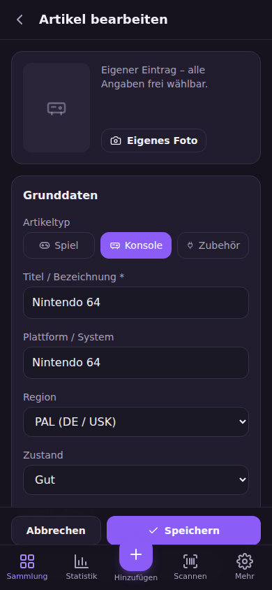

# 🎮 Videospielesammlung

**Deine Retro- und Videospielsammlung – selbst gehostet, mobil, auf Deutsch.**

Videospielesammlung ist eine quelloffene Progressive Web App (PWA) zur Verwaltung von
**Spielen, Konsolen und Zubehör**. Sie ist für Sammlerinnen und Sammler im deutschsprachigen
Raum gemacht: PAL-/USK-Regionen, CIB-Status, Sonderfarben, Editionen und Modellrevisionen
lassen sich sauber erfassen – per Titelsuche, **Barcode-Scan mit der Handykamera** oder als
eigener Eintrag für Raritäten, die in keiner Datenbank stehen.

> 🇬🇧 An English version of this document is available in [README.en.md](README.en.md).

<p align="center">
  
  &nbsp;
  
</p>

---

## Inhalt

- [Funktionen](#funktionen)
- [Schnellstart mit Docker](#schnellstart-mit-docker)
- [Konfiguration (.env)](#konfiguration-env)
- [IGDB-Zugang einrichten](#igdb-zugang-einrichten)
- [Barcode-Scanner & HTTPS](#barcode-scanner--https)
- [Betrieb im Internet (Reverse-Proxy)](#betrieb-im-internet-reverse-proxy)
- [Installation ohne Docker](#installation-ohne-docker)
- [Datensicherung & Updates](#datensicherung--updates)
- [Datenfelder](#datenfelder)
- [API-Überblick](#api-überblick)
- [Mitwirken](#mitwirken)
- [Lizenz](#lizenz)

---

## Funktionen

- **Drei Artikeltypen:** Spiele, Konsolen/Systeme und Zubehör (Controller, Kabel, Memory Cards …)
- **Varianten:** Farbe/Sonderfarbe (z. B. „Clear Red“, „Atomic Purple“), Edition (z. B. „Zelda 25th Anniversary“),
  Modellnummer/Revision (z. B. „SCPH-1002“, „OLED“) und Seriennummer
- **Barcode-Scanner im Browser** (EAN-13, EAN-8, UPC-A, UPC-E) über die Kamera – ganz ohne App-Store
- **Online-Suche über IGDB** (Twitch-API) für Spiele und Konsolen, inkl. Cover, Erscheinungsjahr und Publisher
- **Eigene Katalogeinträge** für Hardware, Zubehör und seltene deutsche Exoten
- **Lernender Barcode-Cache:** Einmal zugeordnete Barcodes werden beim nächsten Scan sofort erkannt
- **Lokaler Cache** in SQLite – wiederholte Suchen sind blitzschnell und schonen API-Limits
- **Eigene Fotos** pro Artikel (z. B. vom Modul oder der OVP)
- **Filter & Suche** nach Typ, Plattform, Region, Zustand und Vollständigkeit
- **Statistik:** Anzahl, Kaufwert, Verteilung nach Plattform, Region, Zustand
- **Export/Import:** JSON (vollständige Sicherung) und CSV im deutschen Excel-Format
- **PWA:** Installierbar auf Android, iOS und Desktop; zuletzt geladene Daten auch offline sichtbar
- **Hell & dunkel:** folgt automatisch dem Farbschema des Geräts
- **Optionaler Zugangsschutz** per Benutzername/Passwort
- **Komplett auf Deutsch** – Oberfläche, Formulare, Meldungen und Dokumentation

**Technik:** Node.js 22 · Express 5 · SQLite (better-sqlite3) · React 19 · Vite · Tailwind CSS 4 · html5-qrcode

---

## Schnellstart mit Docker

Voraussetzung: [Docker](https://docs.docker.com/get-docker/) mit Docker Compose.

```bash
git clone https://github.com/DrdotHouse2106/Videospielesammlung.git
cd Videospielesammlung
cp .env.example .env          # Konfiguration anlegen und bei Bedarf anpassen
docker compose up -d --build  # Image bauen und im Hintergrund starten
```

Die App ist anschließend unter **<http://localhost:3000>** erreichbar.

Nützliche Befehle:

```bash
docker compose logs -f        # Protokoll ansehen
docker compose down           # Anhalten (Daten bleiben erhalten)
git pull && docker compose up -d --build            # Aktualisieren
```

Alle Daten (SQLite-Datenbank und hochgeladene Fotos) liegen im Docker-Volume
`sammlung-daten` und bleiben bei Updates und Neustarts erhalten.

> **Tipp:** Möchtest du die Daten lieber in einem Ordner auf dem Host sehen, ersetze in
> `docker-compose.yml` die Zeile `- sammlung-daten:/app/data` durch `- ./data:/app/data`
> und führe einmalig `mkdir -p data && sudo chown 1000:1000 data` aus.

---

## Konfiguration (.env)

Die gesamte Konfiguration erfolgt über Umgebungsvariablen. Vorlage ist die Datei
[`.env.example`](.env.example) – kopiere sie nach `.env`. **Die `.env`-Datei enthält
Geheimnisse und wird durch `.gitignore` nie ins Repository übernommen.**

| Variable               | Standard                  | Beschreibung |
| ---------------------- | ------------------------- | ------------ |
| `PORT`                 | `3000`                    | Port des Servers (bei Docker: Port auf dem Host) |
| `DATABASE_PATH`        | `data/sammlung.db`        | Pfad zur SQLite-Datenbank (bei Docker fest `/app/data/sammlung.db`) |
| `UPLOAD_DIR`           | `data/uploads`            | Ordner für hochgeladene Fotos (bei Docker fest `/app/data/uploads`) |
| `MAX_UPLOAD_MB`        | `8`                       | Maximale Dateigröße für Fotos |
| `CACHE_TTL_HOURS`      | `168`                     | Gültigkeit zwischengespeicherter Online-Suchen (Stunden) |
| `TWITCH_CLIENT_ID`     | –                         | Client-ID für IGDB (siehe unten) |
| `TWITCH_CLIENT_SECRET` | –                         | Client-Secret für IGDB |
| `BARCODE_PROVIDERS`    | `opengtindb,upcitemdb`    | Reihenfolge der Barcode-Datenbanken; leer = nur lokal gelernte Barcodes |
| `OPENGTINDB_QUERYID`   | –                         | Zugangsnummer für [opengtindb.org](https://opengtindb.org) (deutsche EAN-Datenbank) |
| `AUTH_USER`            | –                         | Benutzername für den Zugangsschutz |
| `AUTH_PASSWORD`        | –                         | Passwort für den Zugangsschutz (beide setzen = Schutz aktiv) |
| `TRUST_PROXY`          | –                         | Hinter einem Reverse-Proxy z. B. `1` setzen |

Ohne IGDB-Zugangsdaten funktioniert die App vollständig – die Online-Suche entfällt dann,
und du legst Artikel als eigene Einträge an.

---

## IGDB-Zugang einrichten

[IGDB](https://www.igdb.com) ist eine umfangreiche, kostenlose Spieldatenbank von Twitch.

1. Melde dich unter <https://dev.twitch.tv/console> mit einem Twitch-Konto an
   (Zwei-Faktor-Authentifizierung muss aktiviert sein).
2. **Anwendungen → Deine Anwendung registrieren**
   - Name: frei wählbar, z. B. `Meine Videospielesammlung`
   - OAuth-Redirect-URL: `http://localhost`
   - Kategorie: `Application Integration`
   - Client-Typ: `Vertraulich`
3. Öffne die Anwendung, kopiere die **Client-ID** und erzeuge ein **neues Geheimnis** (Client-Secret).
4. Trage beide Werte in die `.env` ein und starte neu:

   ```env
   TWITCH_CLIENT_ID=abc123...
   TWITCH_CLIENT_SECRET=xyz789...
   ```

Unter **Mehr → Status** siehst du, ob die Online-Suche aktiv ist.

### Wie funktioniert die Barcode-Suche?

IGDB kennt keine Barcodes. Die App geht deshalb in Stufen vor:

1. **Lokal:** Wurde der Barcode schon einmal einem Artikel zugeordnet, wird er sofort erkannt.
2. **Barcode-Datenbank:** Über [opengtindb.org](https://opengtindb.org) (deutsch, Zugangsnummer nötig)
   bzw. [upcitemdb.com](https://www.upcitemdb.com) (Testzugang, max. 100 Abfragen/Tag) wird der Produktname ermittelt.
3. **IGDB:** Der Produktname wird bereinigt (z. B. „Super Mario Odyssey - [Nintendo Switch] USK 6“ → „Super Mario Odyssey“)
   und bei IGDB gesucht.
4. **Nichts gefunden?** Dann suchst du manuell oder legst einen eigenen Eintrag an – der Barcode wird gespeichert
   und beim nächsten Scan erkannt.

---

## Barcode-Scanner & HTTPS

Browser geben die Kamera **nur über HTTPS** (oder auf `localhost`) frei. Für den Scanner auf dem
Smartphone im Heimnetz brauchst du daher eine HTTPS-Adresse – siehe nächster Abschnitt.
Ohne HTTPS kannst du Barcodes weiterhin manuell eingeben.

---

## Betrieb im Internet (Reverse-Proxy)

Empfohlen ist ein Reverse-Proxy, der automatisch HTTPS-Zertifikate besorgt, z. B. [Caddy](https://caddyserver.com).
Beispiel mit Docker Compose – ergänze die `docker-compose.yml` um:

```yaml
  caddy:
    image: caddy:2
    restart: unless-stopped
    ports:
      - "80:80"
      - "443:443"
    volumes:
      - ./Caddyfile:/etc/caddy/Caddyfile:ro
      - caddy-daten:/data
```

(und unter `volumes:` zusätzlich `caddy-daten:`) sowie eine Datei `Caddyfile`:

```caddyfile
sammlung.example.de {
    reverse_proxy sammlung:3000
}
```

Setze außerdem in der `.env`:

```env
TRUST_PROXY=1
AUTH_USER=deinname
AUTH_PASSWORD=ein-langes-sicheres-passwort
```

> ⚠️ **Wichtig:** Wenn die App aus dem Internet erreichbar ist, **immer** `AUTH_USER` und
> `AUTH_PASSWORD` setzen. Im reinen Heimnetz ist der Schutz optional.

Für den Zugriff nur im Heimnetz eignen sich auch [Tailscale](https://tailscale.com) (mit `tailscale serve`)
oder ein vorhandener Proxy auf dem NAS (Synology, Unraid, Nginx Proxy Manager).

---

## Installation ohne Docker

Voraussetzung: **Node.js 22** oder neuer.

```bash
git clone https://github.com/DrdotHouse2106/Videospielesammlung.git
cd Videospielesammlung
npm ci
cp .env.example .env
npm run build     # Oberfläche bauen
npm start         # Server starten → http://localhost:3000
```

Für die Entwicklung mit Hot-Reload: `npm run dev` (Oberfläche unter <http://localhost:5173>).

---

## Datensicherung & Updates

**Sicherung über die Oberfläche:** *Mehr → Datensicherung → JSON-Export*. Die Datei kann jederzeit
wieder importiert werden. Der CSV-Export ist für Excel/LibreOffice gedacht (Semikolon, Dezimalkomma).

**Sicherung der Datenbank (Docker):**

```bash
docker compose exec sammlung node -e "require('better-sqlite3')('/app/data/sammlung.db').backup('/app/data/sicherung.db')"
docker compose cp sammlung:/app/data/sicherung.db ./sicherung.db
```

Hochgeladene Fotos liegen im Volume unter `/app/data/uploads`.

**Update auf eine neue Version:**

```bash
git pull
docker compose up -d --build
```

Datenbank-Migrationen laufen beim Start automatisch.

---

## Datenfelder

| Feld              | Werte / Beispiel |
| ----------------- | ---------------- |
| Artikeltyp        | Spiel, Konsole, Zubehör |
| Zustand           | Neu/OVP, Wie neu, Sehr gut, Gut, Akzeptabel, Defekt |
| Vollständigkeit   | CIB (Komplett in OVP), Nur Gerät/Disc/Modul, Nur OVP, Fehlt Anleitung |
| Region            | PAL (DE / USK), PAL (EU), NTSC-U, NTSC-J |
| Farbe             | z. B. Atomic Purple, Clear Red |
| Edition/Variante  | z. B. Zelda 25th Anniversary, Collector's Edition |
| Modellnummer      | z. B. SCPH-1002, NUS-001(EUR), HEG-001 |
| Seriennummer      | frei |
| Barcode           | EAN-8, UPC-A, EAN-13, GTIN-14 |
| Kaufpreis         | in Euro, z. B. `49,99` |
| Kaufdatum         | Datum |
| Anzahl            | ganze Zahl ≥ 1 |
| Eigene Notizen    | freier Text |
| Foto              | JPG, PNG, WebP oder GIF |

---

## API-Überblick

Die Oberfläche nutzt eine JSON-API, die du auch für eigene Skripte verwenden kannst.

| Methode | Pfad                              | Beschreibung |
| ------- | --------------------------------- | ------------ |
| GET     | `/api/health`                     | Gesundheitsprüfung (ohne Anmeldung) |
| GET     | `/api/status`                     | Konfigurationsstatus |
| GET     | `/api/meta`                       | Wertelisten (Zustände, Regionen …) |
| GET     | `/api/artikel`                    | Sammlung; Filter: `typ`, `q`, `plattform`, `region`, `zustand`, `vollstaendigkeit`, `sortierung` |
| POST    | `/api/artikel`                    | Artikel anlegen |
| GET/PUT/DELETE | `/api/artikel/:id`         | Artikel lesen, ändern, löschen |
| POST/DELETE | `/api/artikel/:id/bild`       | Foto hochladen (Feld `bild`) bzw. entfernen |
| GET     | `/api/katalog/suche?q=&typ=`      | Suche im lokalen Katalog und bei IGDB |
| GET     | `/api/katalog/barcode/:code`      | Barcode auflösen |
| POST    | `/api/katalog`                    | Eigenen Katalogeintrag anlegen |
| GET     | `/api/statistik`                  | Auswertungen |
| GET     | `/api/export.json` / `export.csv` | Export |
| POST    | `/api/import`                     | JSON-Import |

Fehlermeldungen kommen immer auf Deutsch im Feld `fehler`, bei Validierungsfehlern zusätzlich je Feld in `felder`.

---

## Mitwirken

Beiträge sind herzlich willkommen! Lies dazu bitte die [Beitragsrichtlinien (CONTRIBUTING.md)](CONTRIBUTING.md).
Kurz gesagt: Forken, Branch anlegen, `npm test` und `npm run build` grün halten, Pull Request öffnen.

---

## Lizenz

Veröffentlicht unter der [MIT-Lizenz](LICENSE).

Spieldaten und Coverbilder stammen von [IGDB.com](https://www.igdb.com) und unterliegen deren
Nutzungsbedingungen. Diese App steht in keiner Verbindung zu Nintendo, Sony, Microsoft, Sega
oder anderen genannten Marken.
